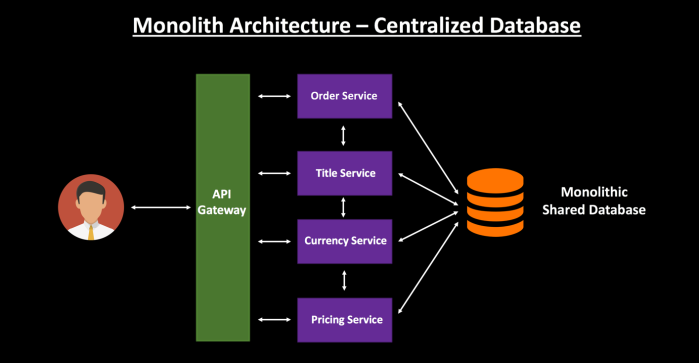
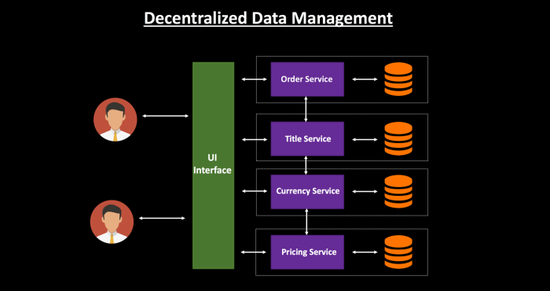

#### [back](../../README.md) &nbsp;&nbsp; | &nbsp;&nbsp; write by [sangcho][sangcho]

# 4. 데이터베이스 접근

> 이 글은 그림으로 공부하는 마이크로 서비스 구조를 참고하여 기록하였습니다.

 

## 1.마이크로서비스란?

    

#### 1.1. 모놀리식 아키텍처

- 모든 프로세스가 긴밀하게 결합되고 단일 서비스로 실행 -> 따라서 애플리케이션의 한 프로세스에 대한 수요가 급증하면 해당 아키텍처 전체를 확장
- 모든 비즈니스 관련 사항을 함께 결합하는 **하나의 코드 베이스를 갖춘 대규모의 단일 컴퓨팅 네트워크**

##### 1.1.1 장점

- 손쉬운 배포 
  - 실행 파일 또는 디렉토리가 하나여서 배포가 더 쉬움.
- 개발
  - 하나의 코드 베이스로 애플리케이션을 구축하여 개발이 더 쉬움.
- 테스트 간소화
  - 하나의 중앙 집중식 장치이므로 분산된 애플리케이션보다 엔드투엔드 테스트를 더 빠르게 수행.
- 간편한 디버깅
  - 모든 코드가 한 곳에 있으므로 요청을 따라가서 문제를 찾기가 더 쉬움.

##### 1.1.2 단점

- 확장성
  - 개별 컴포넌트를 확장 불가.
- 안정성
  - 모듈에 오류가 있으면 애플리케이션 전체의 가용성에 영향.
- 유연성 부족
  - 모놀리스의 경우 모놀리스에서 이미 사용한 기술로 제한.
- 배포
  - 애플리케이션을 약간만 변경하는 경우에도 전체 모놀리스를 다시 배포.

#### 1.2. 마이크로 아키텍처

- 각 구성 요소 서비스는 다른 서비스의 기능에 영향을 주지 않으면서 개발, 배포, 운영하고 확장 가능. ->  개별 구성 요소 간의 통신은 잘 정의된 API를 통해 이루어짐.
- 각 서비스는 일련의 기능을 위해 설계되며 특정 문제를 해결하는 데 중점을 둠. -> 각각의 서비스는 특정한 목적이 존재.

##### 1.2.1 장점

- 민첩성
  - 해당 서비스를 소유한 독립적인 소규모 팀 조직을 육성하는 역할 -> 소규모 컨텍스트 내에서 활동하며 더 독립적이면서 신속하게 업무를 수행
- 유연한 확장성
  - 각 서비스가 지원하는 애플리케이션 기능의 수요를 충족하도록 해당 서비스를 독립적으로 확장 가능.
- 손쉬운 배포
  - 마이크로서비스는 개별적인 유닛이므로 개별 기능을 빠르고 쉽게 독립적으로 배포 가능.
- 기술 유연성
  - 팀에서 원하는 도구를 자유롭게 선택 가능.
- 높은 안정성
  - 전체 애플리케이션이 중단될 위험 없이 특정 서비스에 대한 변경 사항을 배포 가능.

##### 1.2.2 단점

- 무분별한 개발 확산
  - 여러 팀이 더 많은 장소에 더 많은 서비스를 만들기 때문에 모놀리스 아키텍처에 비해 더 복잡함.
- 인프라 비용
  - 테스트 도구, 배포 플레이북, 호스팅 인프라, 모니터링 도구 등에 대한 자체적인 비용이 발생.
- 디버깅 문제
  - 각 마이크로서비스는 자체적인 로그 집합을 가지고 있어 디버깅이 더 복잡함.
## 2.마이크로서비스에서의 서비스의 개념
- 마이크로서비스에서 서비스는 모델(비즈니스 데이터)을 포함한다.

Q1. 서비스란?
A1. 서비스는 비즈니스 기능을 위해 구축되며 서비스마다 한 가지 기능을 수행합니다.

Q2. 모델이란?
A2. 애플리케이션의 정보, 데이터를 나타냅니다. 데이터베이스, 처음의 정의하는 상수, 초기화값, 변수 등을 뜻합니다. 또한 이러한 DATA, 정보들의 가공을 책임지는 컴포넌트를 말합니다.

## 3.모놀리식 아키텍처의 데이터베이스 접근

    

- 데이터베이스는 애플리케이션의 모든 구성 요소에 공유되며 데이터베이스에 대한 접근은 애플리케이션의 모든 구성 요소가 공유
  - 긴밀한 결합이 발생하고 서비스 변경 사항을 독립적으로 배포가 어려움.
  - 동일한 데이터베이스에 접근하는 여러 서비스가 있는 경우 모든 서비스 간에 스키마 변경 사항을 조정해야함.
  - 전체 모놀리식 데이터베이스를 확장할 수 있는 옵션만 있기 때문에 개별 서비스를 확장 어려움.
  - 거대한 테이블을 갖게되면서 필요한 데이터를 가져오기 위해 여러 개의 큰 크기의 테이블을 조인해야 하므로 데이터 검색의 성능이 저하됨.

## 4.마이크로 아키텍처의 데이터베이스 접근

    

- 각 서비스는 자체 데이터베이스를 가지고 있으며 서비스 간에 데이터를 공유하기 위해 해당 서비스를 거쳐 통신
  - Domain Driven Design 을 따르고 제한된 컨텍스트를 가져야 함.
  - 애플리케이션의 기능과 일치하는 도메인을 기반으로 설계.
  - Data First 접근 방식보다 Code First 접근 방식을 따르는 것과 같으므로 먼저 모델을 설계.
  - 비즈니스 모델의 무결성을 유지하기 위해 노력.

 

Q1. Domain Driven Design?
A1. 비즈니스 Domain (유사한 업무의 집합) 별로 나누어 설계하는 방식. 
<https://happycloud-lee.tistory.com/94>

Q2. Data First 접근 방식 vs Code First 접근 방식?
A2. Code First 접근 방식: DB를 미리 설계하지 않고, 코드를 사용하여 클래스를 이용해 Domain Object를 정의하고, 프로그램 실행시 DB가 없으면 자동으로 DB를 생성하는 방식 (domain Class -> Entity Class -> DB Table)
Data First 접근 방식: 기존 DB로부터 테이블 구조들을 읽어, Domain Object를 정의하는 방식 (DB Table -> Entity Class -> domain Class)
<https://codingcoding.tistory.com/869>

---

<strong><참고자료></strong>

[책] [#그림으로 공부하는 마이크로 서비스 구조][그림으로공부하는마이크로서비스구조] - 다루사와 히로유키 지음 -
[사이트] <https://dzone.com/articles/breaking-the-monolithic-database-in-your-microserv>
[사이트] <https://www.atlassian.com/ko/microservices/microservices-architecture/microservices-vs-monolith>
[사이트] <https://aws.amazon.com/ko/microservices/>

---

##### 데이터베이스 접근 end

[그림으로공부하는마이크로서비스구조]: http://www.yes24.com/Product/Goods/111090165?pid=123487&cosemkid=go16600967225125417&gclid=CjwKCAiAmuKbBhA2EiwAxQnt7wiLm4muh4dSpMTm6uRoMe1c8NRvwC6LLp_gwg6L5Mo9trXbgCwm7BoCbqoQAvD_BwE
[sangcho]: https://github.com/SangchoKim
[taeHyen]: https://github.com/rlaxogus0517
[sangkyeng]: https://github.com/sksk713
