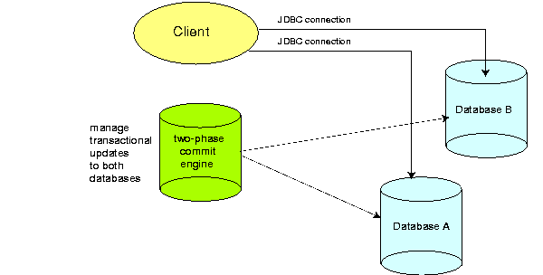

#### [back](../../README.md) &nbsp;&nbsp; | &nbsp;&nbsp; write by [sangcho][sangcho]

# 5. 트랜잭션 처리

> 이 글은 그림으로 공부하는 마이크로 서비스 구조를 참고하여 기록하였습니다.

 

## 1. 트랜잭션이란?

#### 1.1. 개념

- 데이터베이스의 상태를 변경시키기 위해 수행하는 작업 단위
  - 데이터베이스의 상태를 변경시킨다는 이야기는 SELECT, UPDATE, INSERT, DELETE 와 같은 행동
  - 상황에 따라 여러 개가 가능 -> 하나의 트랜잭션은 Commit (저장) 되거나 Rollback (철회)

#### 1.2. 예시
- 예를 들어 우리가 문제를 풀면 포인트로 변경된다고 가정해보자.
   - A, B, C, D 가 문제를 풀어 각각 100 Point 씩 얻었고 이를 DB에 저장하려 한다.
A 저장 완료, B 저장 완료, C 저장 완료, D 저장 실패
이런 상황이 오게 된다면 잘못된 처리이므로 다시 저장을 수행해야 하는데, A, B, C는 그 전에 이미 저장이 완료되었기 때문에 다시 저장을 시작하면 200점이 저장된다.
이런 문제점들을 위해서 트랜잭션은 Commit 과 Rollback 을 이용한다.

#### 1.3. 특징
- 원자성
  - 원자성은 트랜잭션이 DB에 모두 반영되거나, 전혀 반영되지 않거나를 뜻한다. All or Nothing을 생각하면 된다.
- 일관성
    - 일관성은 트랜잭션 작업 처리의 결과가 항상 일관되어야 한다를 뜻한다. 즉, 데이터 타입이 반환 후와 전이 항상 동일해야 한다.
- 독립성
  - 하나의 트랜잭션은 다른 트랜잭션에 끼어들 수 없고 마찬가지로 독립적임을 의미한다. 즉, 각각의 트랜잭션은 독립적이라 서로 간섭이 불가능
- 지속성
   - 트랜잭션이 성공적으로 완료되면 영구적으로 결과에 반영되어야 함을 뜻한다. 보통 commit 이 된다면 지속성은 만족할 수 있다.

## 2. 로컬 트랜잭션이란?

    

#### 2.1. 개념
- 하나의 트랜잭션 컨택스내(begin과 commit으로 설정된 범위)에 처리 대상 리소스등을 제한하는 것.
  - begin은 트랜잭션 시작을 의미하고 commit은 트랜잭션 종료를 의미한다.
  - **하나의 Datasource**에서 발생하는 자체적인 트랜잭션만 관리.

## 3. 글로벌 트랜잭션이란?

    

#### 3.1. 개념

- **여러개의 DtatSource** 에서 발생하는 트랜잭션을 관리.
- 글로벌 트랜잭션은 분산 트랜잭션 구조를 사용해서 구현.
- 투페이스 커밋을 사용.

#### 3.2. Q&A

##### Q1. 분산 트랜잭션 구조?
A1. 둘 이상의 데이터 저장소(특히 데이터베이스)에서 수행되는 데이터에 대한 일련의 작업이다.일반적으로 네트워크로 연결된 별도의 노드에서 조정되지만 단일 서버의 여러 데이터베이스에 걸쳐 있을 수도 있다.

##### Q2. 투페이스 커밋?
A2. 여러 노드에 거쳐서 원자성 트랜잭션 커밋을 달성하기 위한 알고리즘이다. 하지만 하나의 서비스가 장애가 있는 경우나 각각의 서비스에 동시에 Rocking이 걸리게 되면 성능의 문제가 발생하기 때문에 비효율적  

ex) 준비 (prepare) 페이즈에서 분산 트랜잭션에 참여한 서비스 (또는 데이터베이스)에 문제가 발생했다면 Blocking이 걸리지 않고 중단되며, 커밋 (commit) 단계에서 서비스나 코디네이터에 문제가 발생했을 때에 (위에 적어주신 대로) Lock을 계속 잡고 반영될 때까지 재시도  

ex) 투페이스 커밋 예시  
결혼식에서 신랑, 신부에게 ‘결혼에 동의하십니까?’ 를 묻는다.  
신랑, 신부 모두가 ‘예’ 라고 대답한다면 결혼이 성립된다 (커밋)  
모두가 ‘아니오’라고 대답하거나 둘중 한명이 ‘아니오’라고 대답한다면 (롤백)  
누가 먼저 ‘예’ 라고 대답했는지는 중요하지 않다, 왜냐하면 한 사람은 결혼하고 다른 쪽은 결혼하지 않은 상태로 남을일은 없어야 하기 때문이다.

## 4. 마이크로 서비스 아키텍처에서의 트랜잭션 처리
- 각 서비스가 하나의 데이터베이스를 포함하고 트랜잭션 컨텍스트 내에서 해당 데이터베이스만 대상으로 처리 -> 로컬 트랜잭션
- 최대한 단순하게 지속적인 사용이 가능함을 추구하기 때문에 글로벌 트랜잭션이 초래하는 복잡한 운영은 피함.

---

<strong><참고자료></strong>

[책] [#그림으로 공부하는 마이크로 서비스 구조][그림으로공부하는마이크로서비스구조] - 다루사와 히로유키 지음 - 
[사이트] <https://hazelcast.com/glossary/distributed-transaction/>  
[사이트] <https://ko.wikipedia.org/wiki/%EB%B6%84%EC%82%B0_%ED%8A%B8%EB%9E%9C%EC%9E%AD%EC%85%98>  
[사이트] <https://manhyuk.github.io/transaction/>  
[사이트] <https://dongwooklee96.github.io/post/2021/03/26/two-phase-commit-%EC%9D%B4%EB%9E%80/>  
[사이트] <https://wonit.tistory.com/462>  
 
---

##### 트랜잭션 처리 end

[그림으로공부하는마이크로서비스구조]: http://www.yes24.com/Product/Goods/111090165?pid=123487&cosemkid=go16600967225125417&gclid=CjwKCAiAmuKbBhA2EiwAxQnt7wiLm4muh4dSpMTm6uRoMe1c8NRvwC6LLp_gwg6L5Mo9trXbgCwm7BoCbqoQAvD_BwE
[sangcho]: https://github.com/SangchoKim
[taeHyen]: https://github.com/rlaxogus0517
[sangkyeng]: https://github.com/sksk713
