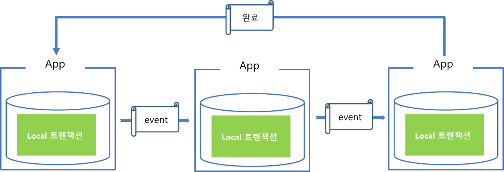

#### [back](../../README.md) &nbsp;&nbsp; | &nbsp;&nbsp; write by [sangcho][sangcho]

# 6. 데이터베이스 간 동기화

> 이 글은 그림으로 공부하는 마이크로 서비스 구조를 참고하여 기록하였습니다.

 

## 1. 배경

- 기존의 Monolithic 환경에서는 DBMS가 기본적으로 제공해주는 트랜잭선 기능을 통해서 데이터 commit이나 rollback을 통해서 일관성있게 관리
- 하지만 Applcation 과 DB가 분산되면서 해당 트랜잭션 처리를 단일 DBMS에서 제공하는 기능으로는 해결 불가능

## 2. 데이터 동기화 방법, 사가 패턴

    

#### 2.1. 개념

- 마이크로서비스들끼리 이벤트를 주고 받아 특정 마이크로서비스에서의 작업이 실패하면 이전까지의 작업이 완료된 마이크서비스들에게 보상 (complemetary) 이벤트를 소싱함으로써 분산 환경에서 원자성(atomicity)을 보장하는 패턴  
즉, 이러한 이벤트 소싱을 통한 정합성 보장을 최종적 (결과적) 일관성 보장 방식

#### 2.2. 예시

##### 이벤트 성공시 동작

    

 

##### 이벤트 실패시 동작

    

- 트랜잭션의 관리주체가 DBMS에 있는 것이 아닌 어플리케이션에 있는 것이 특징.
- 어플리케이션이 분산되어 있을때는 각 어플리케이션은 하위에 존재하는 DB는 로컬 트랜잭션만 담당.
- 각각의 어플리케이션의 트랜잭션 요청의 실패로 인한 Rollback 처리(보상 트랜잭션)은 어플리케이션에서 구현
- 순차적으로 트랜잭션이 처리되며, 마지막 트랜잭션이 끝났을 때 데이터가 완전히 영속되었음을 확인하고 종료. ->  최종 일관성을 보장.

#### 2.3. 패턴의 종류

##### 2.3.1 Choreography based SAGA pattern

    

 

    

- 서비스 내의 로컬 트랜잭션을 관리하며 트랜잭션이 종료하게 되면 완료 이벤트를 발행.
- 만약 그 다음 수행해야할 트랜잭션이 있으면 해당 트랜잭션을 수행해야하는 앱으로 이벤트를 보내고, 해당 앱은 완료 이벤트를 수신받고 다음 작업을 진행 -> 순차적으로 수행.
- 각 앱별로 트랜잭션을 관리하는 로직이 존재 -> 중간에 트랜잭션이 실패하면 해당 트랜잭션 취소 처리를 실패한 앱에서 보상 트랜잭션를 발행해서 Rollback 처리

##### 2.3.2 Orchestration based SAGA pattern

    

 

    

- 트랜잭션 처리를 위해 Saga 인스턴스(Manager)가 별도로 존재, Saga 인스턴스는 트랜잭션을 관리하며 트랜잭션의 상태를 관리.
- 트랜잭션에 관여하는 모든 앱은 Manager에 의해 점진적으로 트랜잭션을 수행하며 결과를 Manager에게 전달.
- 마지막 트랜잭션이 끝나면 Manager를 종료해서 전체 트랜잭션 처리를 종료.
- 만약 중간에 실패하게 되면 Manager에서 보상 트랜잭션을 발동하여 일관성을 유지.
- 모든 관리를 Manager가 호출하기 때문에 분산트랜잭션의 중앙 집중화.

#### 2.4. Q&A

##### Q1. 보상 이벤트(트랜잭션)?

A1. 장애에 의해 서비스가 데이터베이스 변경에 실패한 경우, 장애 발생 이전에 데이터베이스에 적용한 내용을 되돌리는 로컬 트랜잭션을 진행하는 것. 원래대로 되돌리기 위해서 정상 처리의 **반대**로 처리하는 것.

---

<strong><참고자료></strong>

[책] [#그림으로 공부하는 마이크로 서비스 구조][그림으로공부하는마이크로서비스구조] - 다루사와 히로유키 지음 -  
[사이트] <https://hyune-c.tistory.com/39>  
[사이트] <https://www.samsungsds.com/kr/insights/mas_data.html>  
[사이트] <https://learn.microsoft.com/ko-kr/azure/architecture/reference-architectures/saga/saga>  

---

##### 데이터베이스 간 동기화 end

[그림으로공부하는마이크로서비스구조]: http://www.yes24.com/Product/Goods/111090165?pid=123487&cosemkid=go16600967225125417&gclid=CjwKCAiAmuKbBhA2EiwAxQnt7wiLm4muh4dSpMTm6uRoMe1c8NRvwC6LLp_gwg6L5Mo9trXbgCwm7BoCbqoQAvD_BwE
[sangcho]: https://github.com/SangchoKim
[taeHyen]: https://github.com/rlaxogus0517
[sangkyeng]: https://github.com/sksk713
