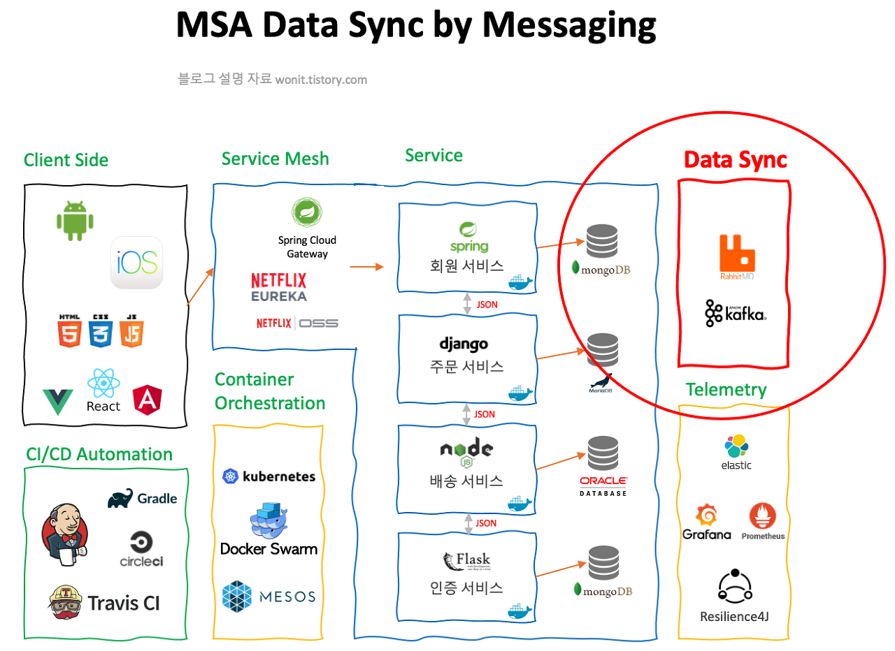

#### [back](../../README.md) &nbsp;&nbsp; | &nbsp;&nbsp; write by [taeHyen][taeHyen]

# 8. 서비스 간 연계

> 이 글은 그림으로 공부하는 마이크로 서비스 구조를 참고하여 기록하였습니다.

 

서비스 간 자주 사용되는 프로토콜로 REST와 메세징이 있다.

##  **REST**
동기형 프로토콜인 REST는 성능과 확장성에 어려움이 있는 프로토콜이다. 하지만 **가장 많이 사용하는 포로토콜인 REST가 왜 성능과 확정성에 어려움이 있을까?**

 **Q1) 성능 문제**

>  포멧이 다른 통신 방식에 비해 무겁다. json이나 excel 포멧 같은 데이터를 보내는 것에 있어서 상대적으로 용량을 크게 먹기 때문이다. 그에 따라 데이터를 보내는 시간 대역 폭에 따라서 해석하는 시간이 길어져 성능이 낮다.

 **Q2) 확장성 문제**
 
> A2) 정해진 json 포멧을 지켜야함. 이것을 지키지 못하면 파싱하지 못하는 경우가 있고, 데이터 변경이 이루어질 때마다 rest api는 계속 수정이 되이어야함.(확장성에 영향)

 

## **메세징(MQTT)**
- 단순한 처리 + 복잡하고 무거운 처리 패턴 고려 + 서비스 간 연계
- MOM을 통해 게시자(생산자)와 구독자(소비자)가 이벤트(메세지)를 주고받는 통신 모델
- 통신 패턴 3가지
  - 단방향 & 비동기형
  - 요청/응답 & 동기형
  - 요청/응답 & 비동기형
  - 비동기형 통신은 확장성을 요하는 경우 적합.

대부분의 MSA에서는 **메세지큐를 활용한 비동기 패턴**을 사용한다.
대표적인 메세지 큐 시스템의 예로 **아파치 Kafka**나 **Rabbit MQ**와 같은 <i>**메세지 브로커**</i>를 사용해서 메세지를 구현한다.

    

메세지 큐의 사용 유무와 관계도를 그림으로 잘 설명 되어있는 글이니 참고 바란다.([MSA의 핵심 구성 요소 - Message Queueing](https://wonit.tistory.com/491))

## **정리**
분산형 데이터베이스 환경에서 데이터를 동기화를 도와주는 사가(Saga)나, CQRS 패턴의 결과적 일관성 등 마이크로 서비스에서는 비동기 메세징을 사용해야하는 경우가 자주있음

### [참고]
- [MQTT와 REST 아키텍처링](https://www.joinc.co.kr/w/man/12/MQTT/Rest)
---

<strong><참고자료></strong>

[책] [#그림으로 공부하는 마이크로 서비스 구조][그림으로공부하는마이크로서비스구조] - 유인동 지음 -

---

##### 서비스 간 연계 end

[그림으로공부하는마이크로서비스구조]: http://www.yes24.com/Product/Goods/111090165?pid=123487&cosemkid=go16600967225125417&gclid=CjwKCAiAmuKbBhA2EiwAxQnt7wiLm4muh4dSpMTm6uRoMe1c8NRvwC6LLp_gwg6L5Mo9trXbgCwm7BoCbqoQAvD_BwE
[sangcho]: https://github.com/SangchoKim
[taeHyen]: https://github.com/rlaxogus0517
[sangkyeng]: https://github.com/sksk713
