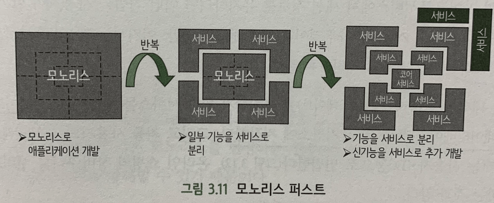

#### [back](../../README.md) &nbsp;&nbsp; | &nbsp;&nbsp; write by [taeHyen][taeHyen]

# 9. 서비스화 진행 방법

> 이 글은 그림으로 공부하는 마이크로 서비스 구조를 참고하여 기록하였습니다.

 

# **애자일 개발, 원 팀, 도메인 주도 설계(DDD)**

    

## **애자일 방법론**

시간에 따라 변화하는 고객(즉, 소프트웨어 개발자) 요구 사항에 대응하는 민첩한(agile) 개발 방식. 이를 위해 개발팀은 협력과 피드백을 자주, 일찍, 잘 하는 것을 목표로함
  - 구성
  모델링 과정을 비지니스와 IT 인력으로구성된 혼성 팀이 같이 추진함. 
  콘웨이 법칙을 적용함으로써 팀 규모는 작게, 필요 전문가가 모두 같은 팀에 소속.
  - 방식
  분할된 비지니스 기능 단위로 모델링과 개발 실시하여 만들어진 것부터 바로 릴리스함. 
  이 방식으로 시스템 전체를 완전히 릴리스하기 위해선 시간이 걸리나 최초 릴리스는 비교적 단기간에 실현 가능.

 

## **도메인 주도 개발(DDD: Domain Driven Design)**

도메인 모델을 설계 및 개발 작업의 중심에 두고, 반복적으로 변경 및 진화시켜서 프로그램 구현으로 이어지도록 하는 것(애자일 개발 프로세스를 전제)

 

## **서비스화는 크게 시작해서 필요에 따라 세분화**

MSA 설계시 ‘반드시 작게 만들어야 하는 것이 아닌가’라는 강박관념에 사로 잡혀 있을 수 있으나, MSA에서는 세분화 정도는 문제가 되지 않고, 유연한 애플리케이션의 개발 및 운영이 실현된다면 세분화 정도는 크든 작든 상관없다.
오히려 ‘**서비스화는 크게 시작해야한다.’** 시작부터 탁상공론 해봤자 실제 운영에는 맞지 않는다면 처음 부터 큰 단위로 만들고 한번 릴리스 후 다음 스프린트에서 작은 서비스로 분할 하자.

## **모노리스 우선(Monolith first ⇒ 모놀리틱)**

- 첫 스프린트에서 시스템 핵심 부분을 모노리스로 설계, 개발, 릴리스하고 다음 스프린트 이후에 기존 모노리스의 서비스화나 신규 기능의 서비스화를 진행하는 방식.
- 처음에는 무리하지 않고 큰 단위로 애플리케이션을 릴리스해버리고, 그 뒤로 필요에 따라 서비스화를 진해아는 방법은 애자일일적이자 합리적인 발상

    

 

## **세션정보 유지**

모던한 SW 설계에서는 애플리케이션을 스테이트리스(Stateless, 비상태유지)로 설계, 구현하는 것을 추진한다.

확장성, 가용성, 쉬운 부하 대응 등

ex) 온라인 쇼핑의 장바구니에서 여러 방면에서 상태 유지시 세션 영구화나 스티키 세션의 기능을 제공한다.

- `세션 영구화`
처리 중인 상태를 ~~DB 등의 영구적~~ 데이터 저장소에 저장해둠 ex) Redis
- `스티키 세션`
처리 상태가 저장돼 있는 서버(프로세스 or 컨테이너)에 클라이어트 요청을 전송하는 것. ex) 쿠버네티스의 인그레스, 로드밸런서
- `상태의 서비스화 기법`(MSA에서 세션 정보 유지시 사용되는 후보)

상태를 유지하기 위한 서비스를 신설하고, 스테이트 자체는 DB 등의 영구 저장소에 저장

 

### **마이그레이션 기간 중의 의존 관계**

기존 모노리스가 신규 릴리스할 서비스에 의존하는 것은 괜찮지만, 신규 서비스가 기존 모노리스에 의존하는 것을 좋지않다. 그 이유는 가까운 미래에 기존 모노리스를 변경하는 경우 더 큰 영향을 미쳐서 MSA의 서비스화를 방해할 수 있기 때문.

### [참고]
- [애자일 개발 프로세스](https://velog.io/@phs880623/%EC%95%A0%EC%9E%90%EC%9D%BC-%EB%B0%A9%EB%B2%95%EB%A1%A0%EA%B3%BC-CI-CD)
- [DDD(Domain Driven Design)](https://incheol-jung.gitbook.io/docs/q-and-a/architecture/ddd)
- [쿠버네티스의 인그레스](https://kubernetes.io/ko/docs/concepts/services-networking/ingress/)

---

<strong><참고자료></strong>

[책] [#그림으로 공부하는 마이크로 서비스 구조][그림으로공부하는마이크로서비스구조] - 다루사와 히로유키 지음 -

---

##### 서비스화 진행 방법 end

[그림으로공부하는마이크로서비스구조]: http://www.yes24.com/Product/Goods/111090165?pid=123487&cosemkid=go16600967225125417&gclid=CjwKCAiAmuKbBhA2EiwAxQnt7wiLm4muh4dSpMTm6uRoMe1c8NRvwC6LLp_gwg6L5Mo9trXbgCwm7BoCbqoQAvD_BwE
[sangcho]: https://github.com/SangchoKim
[taeHyen]: https://github.com/rlaxogus0517
[sangkyeng]: https://github.com/sksk713
