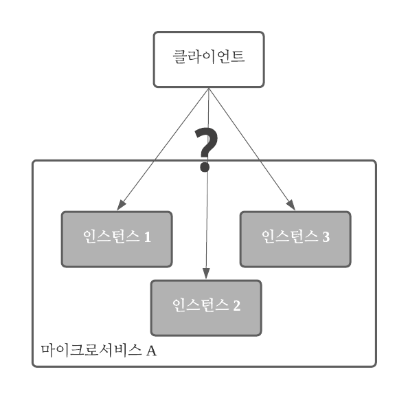
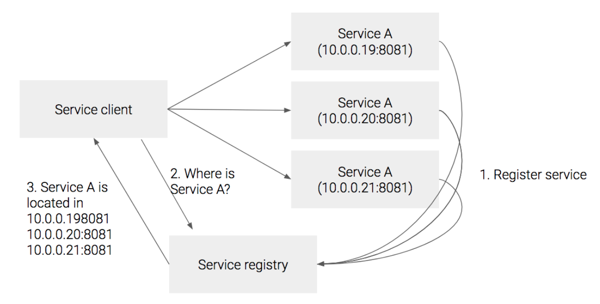
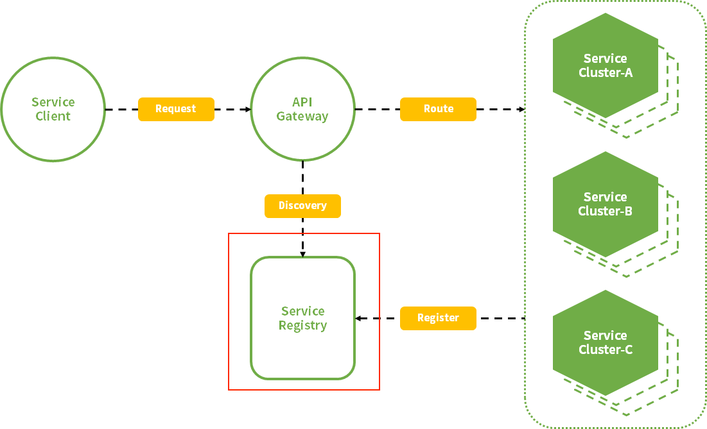

#### [back](../../README.md) &nbsp;&nbsp; | &nbsp;&nbsp; write by [sangcho][sangcho]

# 4. 서비스 검색 패턴

> 이 글은 그림으로 공부하는 마이크로 서비스 구조를 참고하여 기록하였습니다.

 

## 1. 서비스 검색 패턴 배경 (문제)

    

Q. 클라우드 플랫폼에서는 서비스 배포 시마다 도메인명과 IP주소가 변경될 가능성이 존재한다?  

A. 여러 서비스들을 운용할 때에 클라우드 환경에서 인스턴스는 생성, 삭제, 확장 등을 거치면서 IP나 Port들이 동적으로 변경될 가능성이 존재.  
그때마다 서비스 변경사항에 대해서 일일이 알아내고 수정하기에는 수십, 수백개의 서비스들이기에 관리하기 어렵고, 클라이언트가 원하는 정보를 얻기위해 요청 할 서비스를 찾기에 어려움 존재.  
이러한 배경으로 인해 서비스 클라이언트가 서비스를 호출할때 서비스의 위치 (즉 IP주소와 포트)를 알아낼 수 있는 기능이 필요한데, 이것을 바로 서비스 디스커버리 (Service discovery)라고 한다.

 

## 2. 서비스 검색 패턴 예시 (해결)

#### 2.1. 클라이언트 측 검색 (client-side discovery)

    

##### 특징
서비스 인스턴스의 **네트워크 위치를 찾는 역할**을 클라이언트가 담당하는 방식.  

##### 순서
1. Service A의 인스턴스들이 생성 될때, Service A에 대한 주소를 Service registry에 등록
2. Service A를 호출하고자 하는 클라이언트는 Service registry에 Service A의 주소를 물어봄.
3. 등록된 주소를 받아서 그 주소로 서비스를 호출.

##### 장점
1. 서비스 디스커버리 로직을 클라이언트가 가지고 있기 때문에 서비스에 맞는 로드밸런싱 방식을 각자 구현할 수 있다는 점 (?)
2. 간편한 구현 방식

##### 단점
1. 각 서비스마다 서비스 레지스트리를 구현해야 하는 종속성이 생김. 만약 서비스마다 다른 언어를 사용하고 있다면 언어별 또는 프레임워크별로 구현 필요.

#### 2.2. 서버 측 검색 (server-side discovery)

    

##### 특징
서비스 위치를 클라이언트가 찾는 것이 아닌, 서버 측 컴포넌트에 위임하는 방식.

##### 순서
1. Service A의 인스턴스들이 생성 될때, Service A에 대한 주소를 Service registry에 등록.
2. Service A를 호출하고자 하는 클라이언트는 Service registry에 Service A의 주소를 물어봄.
3. 서비스 클라이언트가 로드밸런서를 호출
4. 로드밸런서가 Service registry로 부터 등록된 서비스의 위치를 리턴

##### 장점
1. 의존성이 낮음. (discovery의 세부사항이 클라이언트로부터 분리)
2. 클라이언트는 단순히 로드밸런서에 요청 -> 각 프로그래밍 언어 및 프레임 워크에 대한 검색 로직을 구현할 필요 없음.
3. 일부 배포 환경에서는 이 기능을 무료로 제공

##### 단점
1. 로드밸런서가 배포환경에서 제공되어야 함.

 

## 3. 서비스 레지스트리

    

클라이언트 측 또는 서버 측 검색을 사용해서 알맞은 서비스를 호출하기 위해 서비스 위치 정보를 가지고 있으면서, 요청에 따라 각 서비스에 대한 정보를 영구적으로 데이터를 저장할 수 있는 방안이 필요 또는 적용되어야 하는 영구 데이터 저장소.  

항상 최신 정보를 유지해야 하며 고가용성이 필요.  

ex) Netflix Eureka  
- 각 서비스 인스턴스는 POST 요청으로 자신의 네트워크 위치를 등록하고 30초마다 PUT 요청으로 자신의 정보를 갱신.
- 등록된 서비스 정보는 DELETE 요청이나 타임 아웃으로 삭제.
- 등록된 서비스 정보는 GET 요청으로 조회

## 4. 서비스 레지스트리 등록 패턴 예시

#### 4.1. 자가등록(self registration)

    

##### 특징
서비스 스스로 등록을 관리하는 방식.  

##### 순서
1. 서비스는 서비스 레지스트리에 자신의 정보를 등록
2. 주기적으로 자신이 살아있다는 신호(heartbeat)를 계속 전송
3. 만약 이 정보가 일정 시간이 지나도 오지 않는다면 서비스에 문제가 발생한 것으로 보고 등록이 해제
4. 서비스가 종료될 때는 등록을 해제.

##### 장점
1. 다른 컴포넌트 없이 간단하게 구성 가능
2. 애플리케이션 로직으로 등록 처리를 구현하기 때문에 모든 요건에 유연하게 대응 가능. 

##### 단점
1. 각 서비스에서 서비스 등록 로직을 구현해야 함.
2. 장애 발생 시 복구 처리도 필요 -> 개발 공수에 영향을 줌.

#### 4.2. 외부자 등록(3rd party registration)

    

##### 특징
외부에서 서비스 등록을 관리하는 방식. 서비스 등록을 관리하는 서비스 레지스트라(Service Registrar)를 따로 둠.  

##### 순서
서비스 레지스트라는 각 서비스 인스턴스의 변화(위 1 ~ 4번)를 폴링(polling) 이나 이벤트 구독으로 감지해서 서비스 레지스트리에 계속 업데이트.

##### 장점
1. 서비스에서 서비스 등록 및 관리 로직을 분리 가능.
2. 중앙에서 통제가 가능.

##### 단점
1. 서비스 레지스트라가 멈추면 안되기 때문에 고가용성 등 더 많은 관리가 필요.

---

<strong><참고자료></strong>

[책] [#그림으로 공부하는 마이크로 서비스 구조][그림으로공부하는마이크로서비스구조] - 다루사와 히로유키 지음 -  
[사이트] <https://m.blog.naver.com/justdoplzz/222641974339>  
[사이트] <https://futurecreator.github.io/2018/10/18/service-discovery-in-microservices/>  

---

##### 서비스 검색 패턴 end

[그림으로공부하는마이크로서비스구조]: http://www.yes24.com/Product/Goods/111090165?pid=123487&cosemkid=go16600967225125417&gclid=CjwKCAiAmuKbBhA2EiwAxQnt7wiLm4muh4dSpMTm6uRoMe1c8NRvwC6LLp_gwg6L5Mo9trXbgCwm7BoCbqoQAvD_BwE
[sangcho]: https://github.com/SangchoKim
[taeHyen]: https://github.com/rlaxogus0517
[sangkyeng]: https://github.com/sksk713
