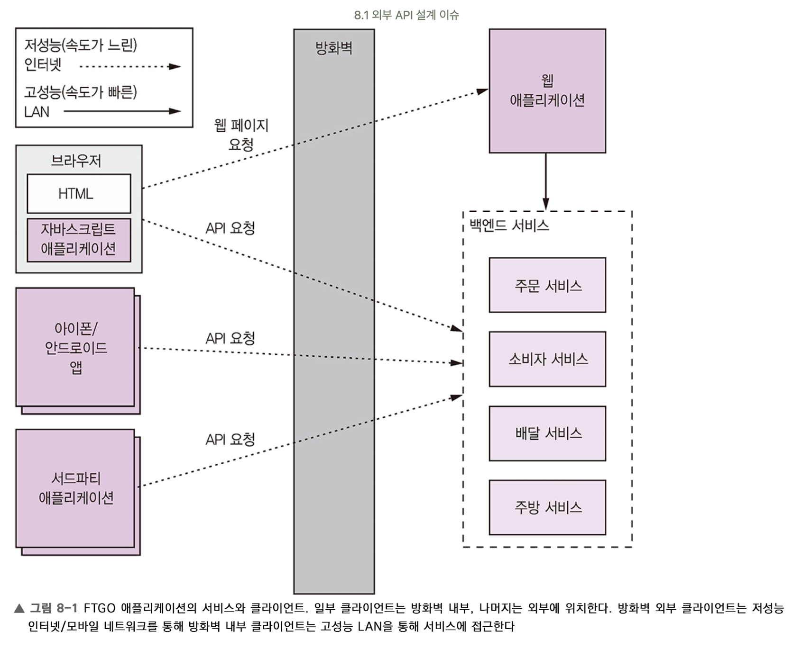
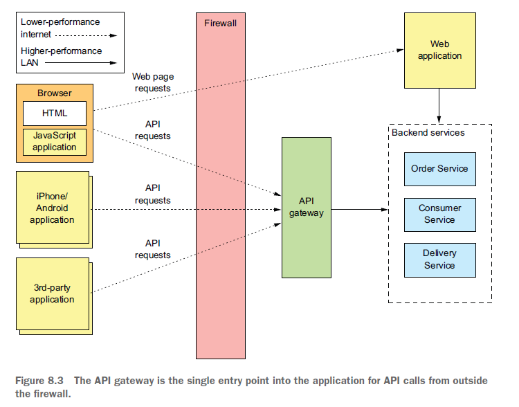

#### [back](../../README.md) &nbsp;&nbsp; | &nbsp;&nbsp; write by [sangcho][sangcho]

# 5. 외부 API 패턴

> 이 글은 그림으로 공부하는 마이크로 서비스 구조를 참고하여 기록하였습니다.

 

## 1. 외부 API 패턴 배경 (문제)

    

#### 1.1 다양한 문제

1. 통신 프로토콜 교환 및 교차
-  클라이언트가 사용하기 실용적이지 못한 프로토콜 등을 서비스에서 사용하고 있을 수 있음.  
ex) 클라이언트 <-> 서비스 통신: http/https기반의 REST, 웹소켓 등,  
데이터 센터 내 서비스 통신: 메시징 등.

2. 네트워크 지연  
- 모바일 환경에서는 네트워크 요청 횟수가 늘어날수록 전력 소모도가 커지므로 배터리 소모량이 큼.
- 비교적 속도가 느린 네트워크인 인터넷에서 클라이언트와 서비스 간 통신 횟수를 최소화하여야 함.

3. 클라이언트 프로그램 코드 
- 서비스 API가 잘게 나뉘어져 있어서 클라이언트가 여러 번 요청을 해야 하고, 대부분 외부망을 통해 접근함으로 네트워크 지연시간이 길어짐.
- 비정상인 경우 수많은 예외처리 코드 작성 필요.
- 코드가 비대해 짐.

4. 유연한 애플리케이션 변경 저해
- 클라이언트가 API를 알아야 하는 구조라서 캡슐화가 되지 않아 강한 결합을 가지게 되는 구조.
- 각 서비스의 변경이 클라이언트 프로그램의 변경에 영향을 미침.

5. 다양한 클라이언트 종류 지원
- 같은 API라도 클라이언트마다 통신 방식, 요청과 응답 형식 등 필요한 데이터가 다름.

#### 1.2 문제 정리

1. 서로 다른 통신 프로토콜 간 통신 해결.
2. 네트워크 지연 경감.
3. 클라이언트 프로그램의 복잡성 방지.
4. 유연하고 빠른 서비스 구현 변경 확보.
5. 다양한 클라이언트 종류 지원.

 

## 2. 외부 API 패턴 예시 (해결)

#### 2.1. API 게이트웨이 패턴

    

##### 특징
도메인 경계에 클라이언트 처리를 담당하는 전용 서비스(API 게이트웨이)를 배치하는 방식.  
단순함과 범용성이라는 관점에서 목적별로 하나의 API 게이트웨이를 두는 것이 좋음  
ex) order -> order API gateway

##### 장점
1. 클라이언트와 서비스 간 호출 횟수를 1회로 줄일 수 있어 **네트워크 지연 최소화**
2. 서비스 측 변경시 API 게이트웨이에서 변경을 흡수하기에 **클라이언트측 영향을 최소화 가능**
3. 네트워크 프로그래밍 작성법을 반복하지 않아도 되어 **코드가 비대해지는 것** 방지 가능.
4. **프로토콜 변환 기능**도 제공. 애플리케이션 내부에서 다른 프로토콜을 혼용 할 경우에도 외부에 단일 REST API 가능

##### 단점
1. 개발, 배포, 관리를 해야하는 고가용 컴포넌트가 하나 더 늘어나는 부담.

#### 2.2. 프론트엔드용 백엔드 패턴(BFF)

    

##### 특징
각 API 모듈을 하나의 클라이언트 팀이 개발/운영하는 Stand Alone API 게이트웨이가 되는 방식.

##### 장점
1. 불특정 다수의 클라이언트가 하나의 API를 공유하는 것이 아닌, 다양한 클라이언트 요청을 지원 할 수 있음.
2. API 게이트웨이가 특정 클라이언트용 처리 로직 변경을 방지, 사이드 이펙트 사전에 방지.
3. API 게이트웨이와 클라이언트 고유의 게이트웨이 기능 분리 가능.
4. 해당 변경 사항에 대한 신속하고 유연하게 대처 가능

##### 단점
1. 클라이언트를 너무 많이 나눌 경우 관리 포인트가 어려워 질 수 있음 -> 종류를 구분하여 작성하는 것이 중요.

---

<strong><참고자료></strong>

[책] [#그림으로 공부하는 마이크로 서비스 구조][그림으로공부하는마이크로서비스구조] - 다루사와 히로유키 지음 -  
[사이트] <https://velog.io/@litien/%EB%A7%88%EC%9D%B4%ED%81%AC%EB%A1%9C-%EC%84%9C%EB%B9%84%EC%8A%A4-%ED%8C%A8%ED%84%B4-%EC%99%B8%EB%B6%80-API-%ED%8C%A8%ED%84%B4>  
[사이트] <https://medium.com/byungkyu-ju/%EB%A7%88%EC%9D%B4%ED%81%AC%EB%A1%9C%EC%84%9C%EB%B9%84%EC%8A%A4%ED%8C%A8%ED%84%B4-8-8%EC%9E%A5-3cbe2bcbd24c>  

---

##### 외부 API 패턴 end

[그림으로공부하는마이크로서비스구조]: http://www.yes24.com/Product/Goods/111090165?pid=123487&cosemkid=go16600967225125417&gclid=CjwKCAiAmuKbBhA2EiwAxQnt7wiLm4muh4dSpMTm6uRoMe1c8NRvwC6LLp_gwg6L5Mo9trXbgCwm7BoCbqoQAvD_BwE
[sangcho]: https://github.com/SangchoKim
[taeHyen]: https://github.com/rlaxogus0517
[sangkyeng]: https://github.com/sksk713
