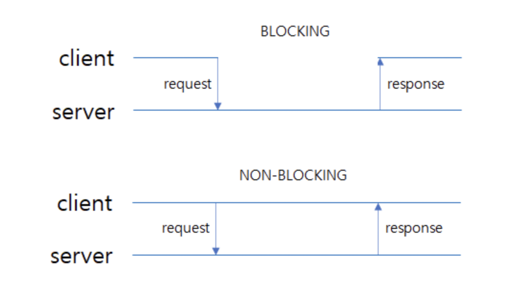
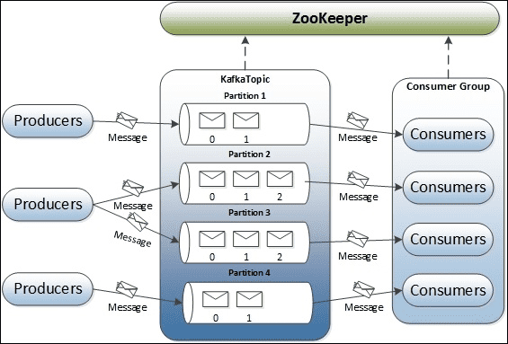
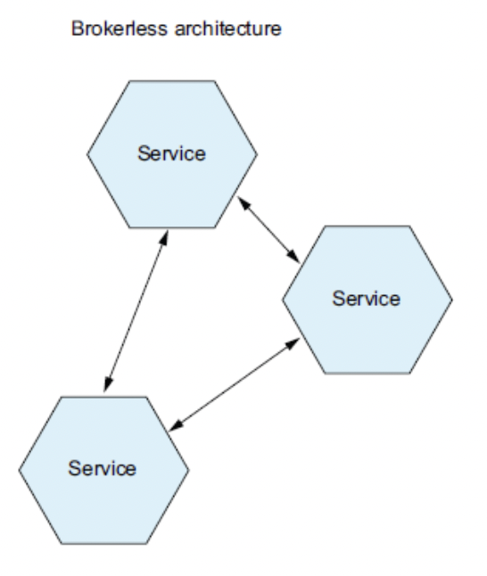
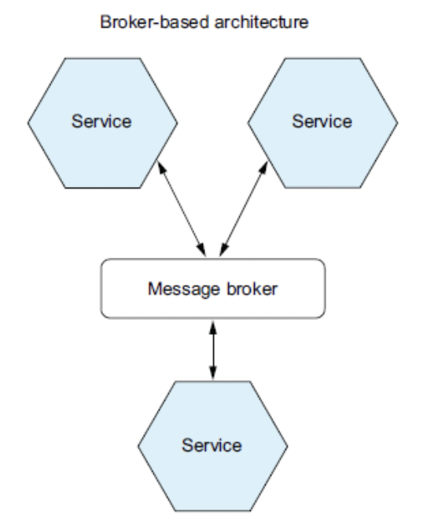

#### [back](../../README.md) &nbsp;&nbsp; | &nbsp;&nbsp; write by [sangcho][sangcho]

# 6. 통신 패턴

> 이 글은 그림으로 공부하는 마이크로 서비스 구조를 참고하여 기록하였습니다.

 

## 1. 통신 패턴 배경 (문제)

#### 1.1. 상호작용 스타일(클라이언트 <-> 서비스)

##### 일대일 / 일대다

- 일대일: 하나의 클라이언트 요청은 하나의 서비스가 처리함.
    - 요청/응답: 클라이언트는 서비스에 요청하고 응답을 블로킹 상태로 대기함.
    - 비동기 요청/응답: 클라이언트는 서비스에 요청을 하고, 논블로킹 상태로 대기함.
    -단방향 알림: 클라이언트는 서비스에 요청을 하고, 응답을 기다리지 않음.
- 일대다: 각 클라이언트의 요청을 여러개의 서비스가 처리함.
    - 발행/구독 : 클라이언트는 메시지를 발행하고, 해당 메시지에 관심이 있는 서비스만 메시지를 소비함.
    - 발행/비동기 응답 : 클라이언트는 메시지를 발행하고, 주어진 시간동안 서비스 응답을 기다림.

##### 동기/비동기

    

- 동기(synchronous): 클라이언트는 자신의 요청에 서비스가 응답할때까지 블로킹 됨. 
- 비동기(asynchronous): 클라이언트는 논블로킹 상태로 다른 업무 수행 가능

***클라이언트와 서비스, 서비스 간의 연동을 최적화하기 위해서는 다양한 프로토콜을 적재적소에 활용, 동기형, 비동기형 통신상태 고려, 멱등성까지 고려 필요***  
 

## 2. 통신 패턴 예시 (해결)

#### 2.1. 원격 프로시저 호출 (Remote Procedure Invocation)

    

##### 특징
요청/응답 및 동기형 통신패턴으로 REST가 그 구현 중 하나로 속하며, 보통 HTTP/HTTPS 기반 통신 프로토콜을 사용하는 경우가 많아서 데이터 센터 내 서비스 간 연동, 인터넷을 경유한 클러이언트와 서비스 간 통신에도 자주 사용됨.

##### 장점
1. 쉽고 간단하고, 범용적임.
2. POSTMAN등 테스트할수 있는 다양한 방법 존재.

##### 단점
1. 확장성이 약함.
2. 복잡하고 시간이 오래 걸리는 통신 처리에는 적합하지 않음 -> 서비스 로직이 복잡하고, 지연이 있으면 응답 연장과 클라이언트 요청이 쌓이면서 장애로 이어질 확률이 높음.
3. 요청/응답만 지원.
4. 가용성이 떨어짐.(서버/클라이언트가 모두 운용 중)

#### 2.2. 메시징

    

##### 특징
발행자와 구독자가 이벤트(메시지)를 통해 통신하는 방식. MOM(큐) 또는 메시지 브로커를 통해서 이벤트를 비동기적으로 전달. 구독자가 원할 때 이벤트를 가지고 올수 있음.

##### 통신 형식

1. 일방향 & 비동기형
2. 요청/응답 & 동기형
3. 요청/응답 & 비동기형

##### 2.2.1 브로커레스 방식

    

##### 특징
메시지를 직접 교환하는 방식.

##### 장점
1. 네트워크 트래픽이 가볍고, 지연시간이 짧음.
2. 브로커가 없어 병목점이 없음.
3. 메시지 브로커를 설정/관리할 필요가 없으므로 운영 복잡도가 낮음.
4. 해당 변경 사항에 대한 신속하고 유연하게 대처 가능.

##### 단점
1. 서비스가 서로의 위치를 알고 있어야 하므로 디스커버리 매커니즘을 사용 필요.
2. 전달 보장 (장애대처)를 할수 없음.

##### 2.2.2 브로커 방식

    

##### 특징
메시지를 교환하는 브로커가 존재하는 방식 (RabbitMQ, 아파치 카프카, AWS SQS) 

##### 장점
1. 클라이언트는 서비스 인스턴스를 몰라도 됨.
2. 컨슈머가 처리 가능한 시점까지 메시지를 버퍼링 함으로써 장애에 대한 복구 등에 처리가 가능.
3. 모든 상호작용 스타일을 지원.

##### 단점
1. 메시지 브로커가 병목점이 될 수 있음.
2. 메시지 브로커가 장애가 될 경우 시스템 전체에 영향이 발생.
3. 브로커 역시 운영 리소스가 필요.

#### 2.3. 도메인 특화 프로토콜

##### 특징
특정 상황에 맞는 고유의 프로토콜을 적용하는 방식, 대상 업무에 최적인 통신 프로토콜이 이미 폭넓게 사용된다면, 서비스 설계시에 고려하는 것이 좋음.  
ex) 메일 발신에서는 SMTP, 메일 수진에서는 POP, IMAP

#### 2.4. 멱등 소비자

    

##### 특징
멱등성이란 실행 횟수에 상관없이 결과가 같다는 것을 보장하는 특성을 가짐. 유일한 메시지가 생성되나 장애 발생, 장애에 대한 복구등으로 인해 동일한 메시지가 중복으로 발생, 소비 될 가능성이 존재. 이러한 문제를 보장하는 통신 방식.

##### 순서
###### 소비자 신용카드를 승인하는 메시지 핸들러는 주문별로 정확히 1회 신용카드를 승인해야함.

1. 컨슈머는 메시지를 처리할 때 비즈니스 엔터티를 생성/수정하는 트랜잭션의 일부로 메시지 ID를 DB 테이블에 기록.
2. 컨슈머는 PROCESSED_MESSAGES라는 전용 테이블(dedicated table)에 메시지 ID가 포함된 로우를 삽입.
3. 중복된 메시지라면 INSERT 쿼리가 실패.

---

<strong><참고자료></strong>

[책] [#그림으로 공부하는 마이크로 서비스 구조][그림으로공부하는마이크로서비스구조] - 다루사와 히로유키 지음 -  
[사이트] <https://velog.io/@injoon2019/%EC%9D%B8%ED%94%84%EB%9D%BC-%EB%A7%88%EC%9D%B4%ED%81%AC%EB%A1%9C%EC%84%9C%EB%B9%84%EC%8A%A4-%ED%8C%A8%ED%84%B4#%EB%A9%94%EC%8B%9C%EC%A7%80>  
[사이트] <https://thebook.io/007035/ch03/03/06/02/>  

---

##### 통신 패턴 end

[그림으로공부하는마이크로서비스구조]: http://www.yes24.com/Product/Goods/111090165?pid=123487&cosemkid=go16600967225125417&gclid=CjwKCAiAmuKbBhA2EiwAxQnt7wiLm4muh4dSpMTm6uRoMe1c8NRvwC6LLp_gwg6L5Mo9trXbgCwm7BoCbqoQAvD_BwE
[sangcho]: https://github.com/SangchoKim
[taeHyen]: https://github.com/rlaxogus0517
[sangkyeng]: https://github.com/sksk713
