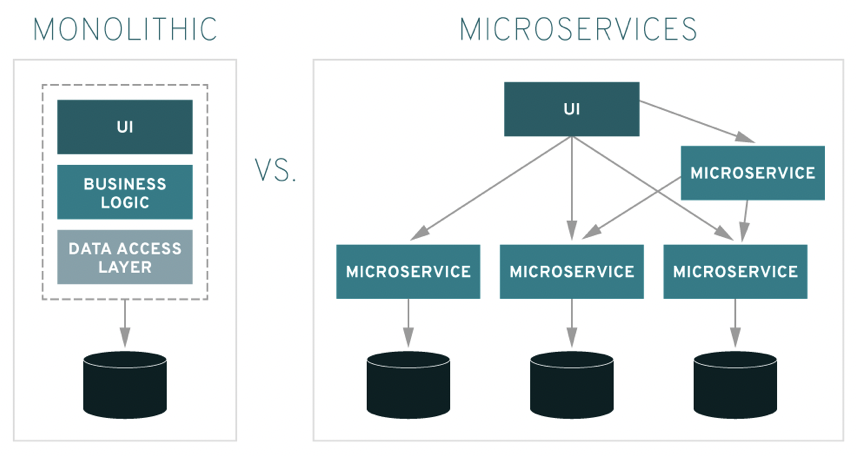
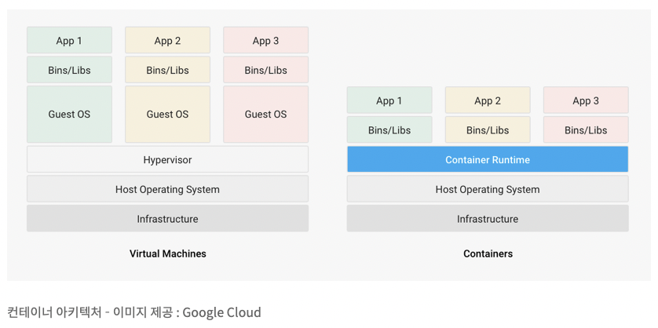
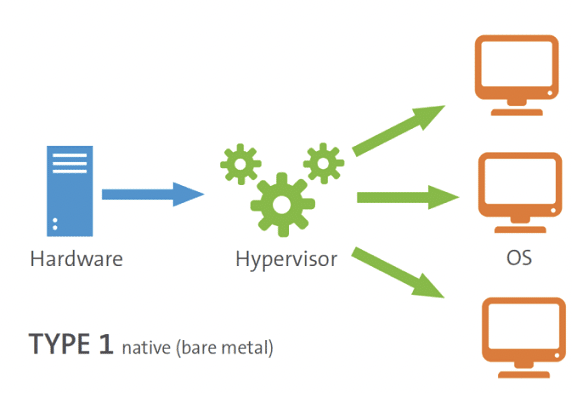
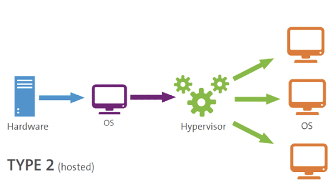

#### [back](../../README.md) &nbsp;&nbsp; | &nbsp;&nbsp; write by [taeHyen][taeHyen]

# 7. 데이터 결합

> 이 글은 그림으로 공부하는 마이크로 서비스 구조를 참고하여 기록하였습니다.

 

## 배포

기존 모노리스에선 인프라 운영팀 쪽에서 배폴르 의뢰하는 것이 일반적 이었으나, 최근에는 CI/CD(지속적 통합/지속적 전달) 도입으로 인해 릴리스가 대폭 자동화 됨

최근에는 인프라 운영팀의 배포 프로세스가 데브옵스라는 방식을 따라서 개발 팀+ 인프라 운영팀이 협력하여 서비스를 제공함.

[배경지식] [컴파일, 빌드, 배포 개념 및 CI/CD 개념 정리](https://velog.io/@choi-ju12g/컴파일-빌드-배포-개념-및-CICD-개념-정리)

 

### 기본적인 배포 과정 4가지

- Development:
    - 로컬 컴퓨터 환경에서 개발 및 테스트
    - 더미데이터를 이용
    - 변경사항이 있어도 문제가 되지 않음
    - 모든 구성원이 각자의 환경에서 진행
- Intergration:
    - 각자의 환경에서 개발된 부분을 취합
    - 코드간 Conflict가 없는지 확인하는 단계
    - 작성한 코드가 다른 코드에 문제를 발생시키지 않는지 확인
- Staging:
    - Production단계와 가장 유사한 환경에서 테스트
    - 복제된 실제데이터를 이용해서 테스트
    - 모든 관계자들에게 검증하는 단계
- Production:
    - 개발환경과는 구분된 환경
    - 실제 데이터를 이용
    - 실제로 서비스가 제공되는 단계

 

### 모놀리식 → MSA

    

모노리스 배포 위치는 물리 머신 자체였지만 가상화 기술을 사용하면서 인프라 운영팀이 더 쉽고 빠르게 앱 개발팀에게 가상머신을 제공하게 됨.

- 모노리스 - 온프레미스
- MSA - IaaS/CaaS/PassS

 

### 서버리스(Serverless)

애플리케이션 실행에 필요한 클라우드 리소스를 동적으로 할당한 서비스. 서버가 필요없다는 뜻이 아니라 클라우드상에 존재하는 서버.

하지만 스스로 관리해야하는 서버나 컨테이너가 없이 이벤트(트리거)에 따라 동작하는 수준의 함수로 구성됨.

개발자가 개발에 집중 할수 있도록 구성됨

사용 예)

- **BaaS (Backend as a Service)** : `Firebase` …
- **FaaS (Function as a Service)** : `AWS Lambda`, `Azure Functions`, `Google Cloud Functions`

 

### 컨테이너(Container)

Docker에 따르면 컨테이너는 코드, 런타임, 시스템 도구, 시스템 라이브러리 및 설정과 같이 컨테이너를 실행하는데 필요한 모든 것을 포함하는 SW의 경량 독립 실행형 패키지이다.

컨테이너는 기본적으로 해당 환경에서 격리하여 하나의 컴퓨팅 환경에서 이동 한 소프트웨어 실행 문제를 해결한다. 예를 들어 컨테이너를 사용하면 소프트웨어를 개발에서 스테이징으로, 스테이징에서 프로덕션으로 이동할 수 있으며 모든 환경의 차이에 관계없이 안정적으로 실행할 수 있다.

    

 

## 배포 패턴 필요성

1. **분산 애플리케이션**
마이크로서비스를 구성하는 개별 애플리케이션을 어떤 단위로 패키지화하고 어떤 단위로 플랫폼 또는 런타임으로 배포하는가에 따라 배포 아키텍처의 설계가 크게 달라진다.
2. **확장성**
시스템 리소스의 가동률을 최적화하려면 적잘 배포 패턴을 선택해야한다. 
개별 서비스가 독립돼 있어서 확장하는 시점도 마이크로서비스 단위마다 달라 확장성 설계가 복잡해지고 리소스에 영향을 주게 되어 서비스 단위로 최적의 배포 패턴을 선택해야 확장성 확보가 가능하다.
3. **유지/보수**
모노리스 애플리케이션처럼 인프라 운영팀이 서버나 서비스를 수도으로 설정하는 것을 최근 트렌드에는 맞지않고 비현실적이다.
운영 단계에서 마이크로서비스 단위로 변경하는 것은 쉽지만, 시스템 전체적으로 변경에 필요한 영향 범위를 확인하는 것은 쉽지가 않아 운영 리소스를 최적화하려면 고도로 자동화된 배포 프로세스와 아키텍처가 필요하다.
4. **최신 기술 도입**
MSA에서는 가능한 최신 클라우드 기술을 도입해야한다
기존에는 가상 머신이 중심이었으나, 요즘에는 컨테이너나 서버리스가 일반적이다
자동화의 중요서이 높아지고 애자일 개발이 진황하면서 CI/CD가 가속화되었기 대문

 

## 배포 패턴의 예

### 호스트별 다중 서비스 인스턴스

한 대의 호스트에서 다중 서비스를 실행하는 모델(multiple service instance per host 패턴)

    

**장점**

- 호스트 관리가 용이
인프라 운용에 필요한 작업 부하는 일반적으로 호스트 수에 비례해서 호스트 단위로 다중 서비스를 운임하면 인프라 운영 비용을 줄일 수 있다.
- 가상환경시
가상 머신이 늘어나면 가상화 부하가 늘어나므로 가능하면 하나의 가상 머신에서 여러 서비스를 실행해서 전체 리소스를 줄일 수 있다

**단점**

- 한 대의 호스트에서 여러 개의 서비스 운영시 모니터링이나 장애 관리에 문제가 생김
- 특정 서비스에 큰 부하가 걸릴시, 다른 서비스가 사용할 수 있는 리소스가 줄어들어 성능에 영향을 줌

 

### 호스트별 단일 서비스 인스턴스

호스트 마다 하나의 서비스를 가지는 모델(single service instance per host 패턴)

    

**장점**

- 특정 호스트가 정지돼도 영향받는 서비스는 하나이므로 장애 관리에 효율이 높다
- 시스템 전체적인 복잡성이 줄어든다

**단점**

- 호스트 수가 늘어나면서 비용도 함께 늘어나 비용 부담이 있다.

---

 

### VM별 서비스 인스턴스

배포 대상으로 하이퍼바이저(hypervisor)형 가상머신을 이용한 패턴.

가상 머신은 배포 대상 옵션으로 무겁고 배포에 시간이 걸려 컨테이너 보다 많은 리소스를 사용함.

반면 많은 퍼블릭 클라우드 서비스가 배포 파이프라인을 통해 필요한 SW가 패키지화된 가상 머신 이미지를 서비스 인스턴스로 제공한다

장점

- 서비스 인스턴스 패키지화 가능
- 서비스 인스턴스 분리 용이

단점

- 배포 시간이 걸림
- 리소스 사용법이 비효율적
- 시스템 관리 비용 높음

**하이퍼바이저란?**

물리적 하드웨어에 설치된 소프트웨어 계층으로, 물리적 머신을 다수의 가상 머신(Virtaul Machine, VM)으로 분할할 수 있도록 해준다.
즉, 호스트 컴퓨터에서 다수의 운영 체제(operating system)를 동시에 실행하기 위한 논리적 플랫폼

1. **Native 하이퍼바저**
호스트 하드웨어에서 직접 실행되어 하드웨어를 제어하고 게스트 가상머신을 관리한다.
    

      
    

    
    예) Xen , Oracle VM Server for SPARC, Oracle VM Server for x86, Microsoft Hyper-V, VMware의 ESX / ESXi
    
2. **Hosted 하이퍼바이저**
게스트 OS는 호스트에서 프로세스로 실행되는 반면 하이퍼바이저는 게스트 OS와 호스트 OS를 분리한다.
운영에 있어 호스트 운영 체제에 전적으로 의존한다. 기본 운영 체제에서 실행되는 하이퍼바이저가 안전하더라도 기본 운영 체제의 모든 문제는 전체 시스템에 영향을 준다
    

      
    

    
    예)VMware Workstation, VMware Player, VirtualBox, Parallels Desktop for Mac
    
 

보충) _참고로 Native 방식이 Hosted 방식에 비해 컴퓨팅 리소스에 대한 가상화 오버헤드가 적어 더 많은 리소스와 성능을 누릴 수 있지만 반대로 Hosted 방식처럼 OS를 통해 리소스에 접근 가능한 API를 제공 받지 못하기 때문에, 구현 난이도가 높고 호환성이 낮아 지원하는 OS의 종류가 Hosted 방식에 비해 상대적으로 적다._

---

 

### 컨테이너별 서비스 인스턴스

컨테이너라는 OS 수준의 가상화 기술을 사용해 서비스 인스턴스를 구성하는 패턴.

서버리스와 달리 범용적인 프로그래밍 언어 사용기 나으하며, 쿠버네티스를 이용해서 대량의 컨테이너를 효율적으로 관리가 가능함.

장점

- 빠른 배포속도
- 높은 리소스 효율
- 좋은 이동성

단점

- 쉽지않은 컨테이너 기반 구축 및 운영

보충) _구축 비용은 클 수 있을 것 같지만 운영 난이도나 리소스는 컨테이너 기반의 서비스가 덜 들어 갈듯 하다._

---

 

### 서버리스배포

퍼블릭 클라우드가 제공하는 서버리스 서비스를 이용해 배포하는 패턴. 

HTTP를 이용하는 웹앱이나 모바일 앱에서 이벤트나 호출을 받으면, 서버리스 서비스를 이용하여 애플리케이션 로직을 실행하는 방식.

퍼블릭 클라우드가 자동 확장, 가용성 관리, 유지/보수 등을 알아서 관리해줌.

장점

- 서버 리소를 의식하지 않으므로, 서버 관리 및 운영이 불필요
- 서비스 부하에 따라 자동으로 확장 or 축소
- 서비스 요청량을 기준으로 과금

단점

- 지연 발생
- 이벤트/요청 기반의 프로그래밍 모델로 제한됨

[참고]

1. [배포과정](https://velog.io/@dev_shu/Deploy배포)
2. [AWS 기준 CI/CD 4가지 배포전략](https://dev.classmethod.jp/articles/ci-cd-deployment-strategies-kr/)
3. [서버리스 아키텍처](https://colinch4.github.io/2021-01-15/8아키텍처_02_서버리스-개념잡기/)
4. [컨테이너 vs 서버리스](https://tommypagy.tistory.com/247)
5. [하이퍼바저](https://born-dev.tistory.com/38)

<strong><참고자료></strong>

[책] [#그림으로 공부하는 마이크로 서비스 구조][그림으로공부하는마이크로서비스구조] - 다루사와 히로유키 지음 -

---

##### 서비스화 진행 방법 end

[그림으로공부하는마이크로서비스구조]: http://www.yes24.com/Product/Goods/111090165?pid=123487&cosemkid=go16600967225125417&gclid=CjwKCAiAmuKbBhA2EiwAxQnt7wiLm4muh4dSpMTm6uRoMe1c8NRvwC6LLp_gwg6L5Mo9trXbgCwm7BoCbqoQAvD_BwE
[sangcho]: https://github.com/SangchoKim
[taeHyen]: https://github.com/rlaxogus0517
[sangkyeng]: https://github.com/sksk713
