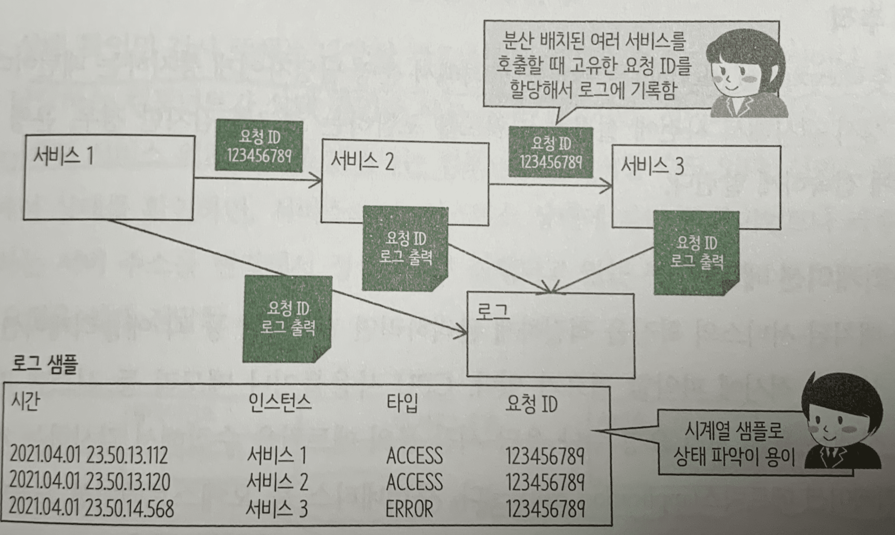
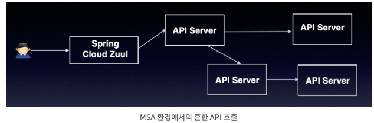
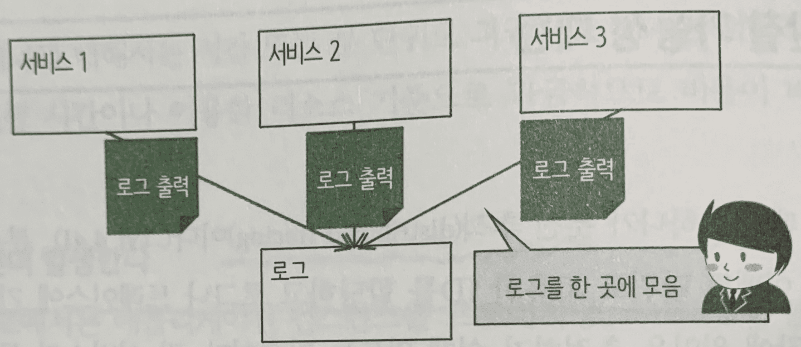

#### [back](../../README.md) &nbsp;&nbsp; | &nbsp;&nbsp; write by [taeHyen][taeHyen]

# 7. 데이터 결합

> 이 글은 그림으로 공부하는 마이크로 서비스 구조를 참고하여 기록하였습니다.

 
마이크로서비스에서는 감시 대상인 각 서비스나 고나련 컴포넌트가 놀리적 or 물리적으로 분산 배치 되어있다. 이들을 빠짐없이 확실하게 감시하기 위해서 요구되는 것이 관찰 가능성(observalbility. 가시성) 패턴이다.

 

## 분산 추적

각 요청 or 이벤트 단위로 고유한 ID를 할당하고 로그나 트레이스에 기록하므로 처리 상황이나 장애 원인을 추적하기 쉽게 만드는 기술. 

각 서비스가 독립된 컨테이너나 프로세스로 실행되는 마이크로서비스에서는 필수 패턴

    

MSA 구조에서는 하나의 HTTP 호출이 내부적으로 여러 개의 서비스를 거쳐서 일어나게 되고, 트랜잭션이 여러 컴포넌트의 조합을 통해서 발생하기 때문에 전통적인 APM(Application performance Monitoring) 도구를 이용해서 추적이 어렵다.
→ 이런 문제를 해결하기 위해, 별도의 분산 로그 추적 시스템이 필요

    

**OpenTracing**

애플리케이션 간에 분산된 호출 흐름을 공개적으로 추적하기 위한 표준.

해당 OpenTracing spec을 기준으로 여러 Tracer(Zipkin, Jaeger가 존재

 

## 로그통합

    

로그 분산에 의한 문제를 미연에 방지하기 위해 로그를 한곳에 모으는 패턴.

오래된 기술로 시스로그(Syslog), 플루엔티드(Fluentd) 등의 상용 및 오픈소스 솔루션이 이 패턴의 예

 

## 예외 추적

예외를 관리해서 운영 담당자에게 통지하는 패턴.

 

## 애플리케이션 메트릭스

CPU 사용률이나 메모리 등 시스템 리소스 사용 상태는 물론 처리 요청 수나 응답 시간 등의 메트릭을 수집해서 감시하는 패턴. 

쿠버네티스 등 오케스트레이션 프레임워크는 애플리케이션 메트릭을 통해 수집한 정보를 바탕으로 확장을 관리함.

 

## 감사로그

기업 시스템을 대상으로 악의적인 공격이나 범죄 및 내부자 범죄로 인해 마이크로 세그멘테이션(micro-segmentation)에 의한 제로 트러스트(zero-trust)와 같은 대책은 물론, 감시 정보를 기록하고 관리하는 기본적 대책도 요구되는데 감사로그는 사용자 활동 통계와 분석을 목적으로 하는 패턴

- zero-trust: ‘데이터에 대한 모든 접근을 신뢰하지 않는다’를 전제로 보안 대책을 세우는것. 마이크로 세그멘테이션은 제로 트러스트의 실현 방법 중 하나. 네트워크 여러 개의 작은 세그먼트로 분할해서 세그먼트 칸에 가상의 방화벽을 배치하는 기술

 

## 상태 확인 API

감시 주체인 컴포넌트가 각 서비스의 인스턴스에  폴링(polling) 요청을 전송해서 그 결과를 가지고 서비스 상태를 파악

상태 확인의 감시 주체는 다양한 컴포넌트에 위임 가능하다.

서비스 레지스트리(service registry)처럼 서비스 위치 해결을 책임지는 컴포넌트가 감시할 수 있다.

Q) health check ? fetch시 option status?

[참고]

1. [마이크로 서비스 아키텍처 환경에서의 분산 로그 트레이싱](https://jhhj424.tistory.com/66)
2. [Google Cloud에서 마이크로서비스 애플리케이션의 분산 추적](https://cloud.google.com/architecture/microservices-architecture-distributed-tracing?hl=ko)

[참고]

1. [배포과정](https://velog.io/@dev_shu/Deploy배포)
2. [AWS 기준 CI/CD 4가지 배포전략](https://dev.classmethod.jp/articles/ci-cd-deployment-strategies-kr/)
3. [서버리스 아키텍처](https://colinch4.github.io/2021-01-15/8아키텍처_02_서버리스-개념잡기/)
4. [컨테이너 vs 서버리스](https://tommypagy.tistory.com/247)
5. [하이퍼바저](https://born-dev.tistory.com/38)

<strong><참고자료></strong>

[책] [#그림으로 공부하는 마이크로 서비스 구조][그림으로공부하는마이크로서비스구조] - 다루사와 히로유키 지음 -

---

##### 서비스화 진행 방법 end

[그림으로공부하는마이크로서비스구조]: http://www.yes24.com/Product/Goods/111090165?pid=123487&cosemkid=go16600967225125417&gclid=CjwKCAiAmuKbBhA2EiwAxQnt7wiLm4muh4dSpMTm6uRoMe1c8NRvwC6LLp_gwg6L5Mo9trXbgCwm7BoCbqoQAvD_BwE
[sangcho]: https://github.com/SangchoKim
[taeHyen]: https://github.com/rlaxogus0517
[sangkyeng]: https://github.com/sksk713
