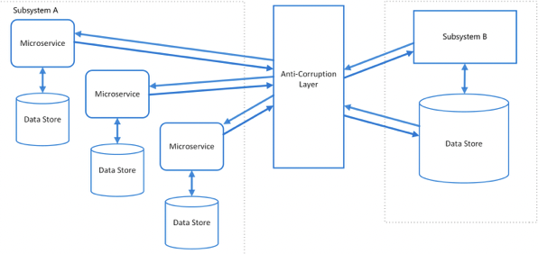
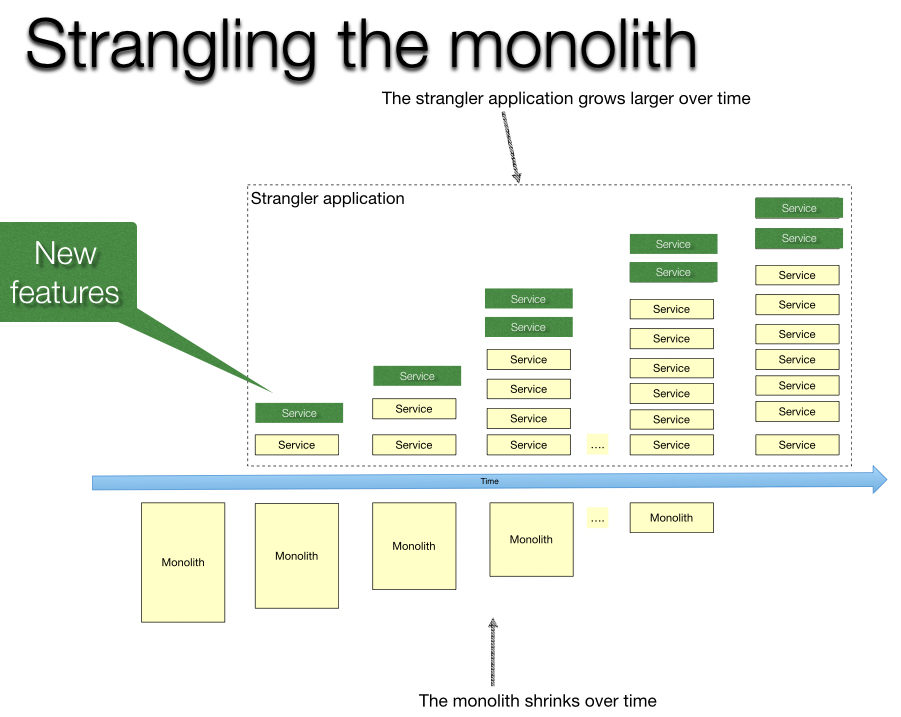

#### [back](../../README.md) &nbsp;&nbsp; | &nbsp;&nbsp; write by [taeHyen][taeHyen]

# 7. 데이터 결합

> 이 글은 그림으로 공부하는 마이크로 서비스 구조를 참고하여 기록하였습니다.

 

# 리팩터링 패턴

## 리팩터링 패턴이란?

개발이 끝난 시스템을 프로덕션 시스템으로 마이그레이션 할때 필요한 리팩터링 패턴

마이크로서비스가 모노리스에 의존하지 않는 것이 좋다.

**리팩터링 과제 예**

1) 서비스와 모노리스 연계

- 프로토콜 차이를 어떻게 해결할 것인가?
- 서비스가 모노리스에 의존하지 않는 연계 기법

2) 클라우드 네이티브 애플리케이션으로 옮기는 방법

- 높은 빈도와 신속한 서비스 릴리스

DX를 이끌려면 운영을 지속하면서 서비스 릴리스는 작은 단위로 여러번 실시하는 것이 이상적

마이그레이션도 애자일로 실시하는 것이 마이크로 서비스의 방식.

새로운 서비스가 비지니스 오너의 기대에 부응하는지 **검토와 피드백 반영을 반복하면서 진행**

 

# 리팩터링 패턴의 예

## 부패방지 계층(Anti-Corruption Layer)

서비스와 모노리스 연계 시 발생하는 통신 프로토콜이나 애플리케이션 프로토콜의 차이를 해결하기 위한 패턴

서비스와 모노리스 사이에 어댑터를 설치.

    

Azure의 손상 방지 계층 패턴 솔루션 아키텍쳐

이 어댑터에는 서비스로부터 호출되는 인터페이스로서 REST API를 구현하고, REST API 호출을 받아서 SOAP를 거쳐 모노리스의 웹 API 호출하는 기능을 구현한다.

또한 REST와 SOAP 기반 RPC 사이에 애플리케이션 프로토콜을 교환하는 로직도 추가.

이 어댑터를 사용하면 모노리스에 의존하지 않고 `양쪽 연계`가 가능하다.

 

## 스트랭글러 애플리케이션(Strangler Application)

각 릴리스마다 스트랭글러 포드(strangler pod)를 개발 및 배치한다. 일종의 포털 시스템이며, 사용자는 스트랭글러 포드가 제공하는 메뉴 화면에서 고객명ㅇ르 클릭하여 특정 애플리케이션을 이용하는 것.

    

이 패턴에선 각 단계의 마이그레이션 작업이 끝나면 애플리케이션으로 가는 요청이 마이크로서비스화된 서비스로 라우팅 되도록 스트랭글러 포드의 메뉴 아이템이 가리키는 URI를 변경한다.

이 구조를 활용하므로 마이그레이션 작업 후 바로 서비스 릴리스가 가능하며, 사용자가 서비스를 빠르게 접할 수 있다.

[참고]

1. [Azure의 손상 방지 계층 패턴](https://learn.microsoft.com/ko-kr/azure/architecture/patterns/anti-corruption-layer)
2. [스트랭글러 패턴](https://sas-study.tistory.com/460)
3. [Azure의 스트랭글러 그림 패턴](https://learn.microsoft.com/ko-kr/azure/architecture/patterns/strangler-fig)

<strong><참고자료></strong>

[책] [#그림으로 공부하는 마이크로 서비스 구조][그림으로공부하는마이크로서비스구조] - 유인동 지음 -

---

##### 서비스화 진행 방법 end

[그림으로공부하는마이크로서비스구조]: http://www.yes24.com/Product/Goods/111090165?pid=123487&cosemkid=go16600967225125417&gclid=CjwKCAiAmuKbBhA2EiwAxQnt7wiLm4muh4dSpMTm6uRoMe1c8NRvwC6LLp_gwg6L5Mo9trXbgCwm7BoCbqoQAvD_BwE
[sangcho]: https://github.com/SangchoKim
[taeHyen]: https://github.com/rlaxogus0517
[sangkyeng]: https://github.com/sksk713
