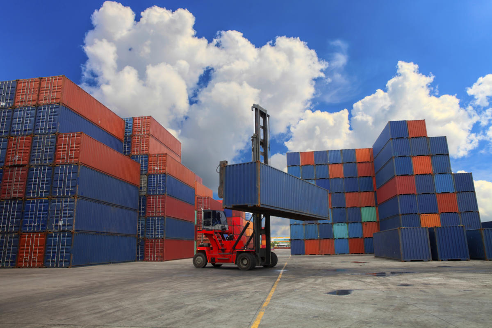
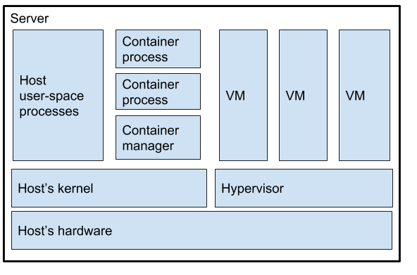
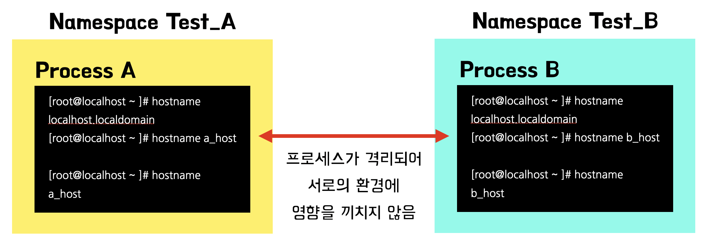
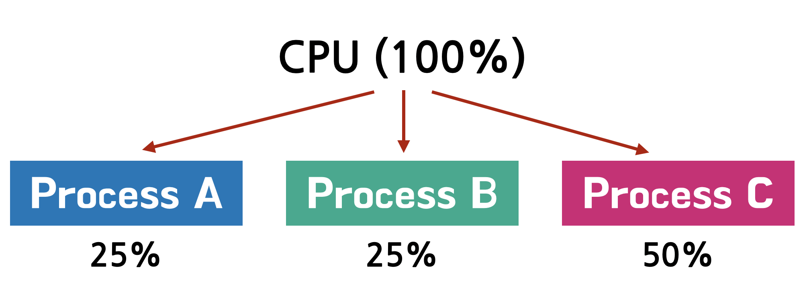
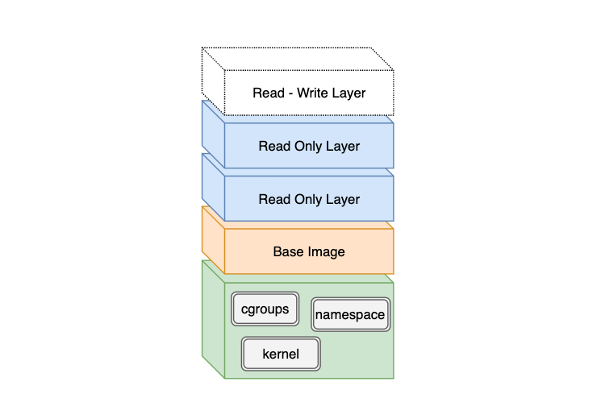
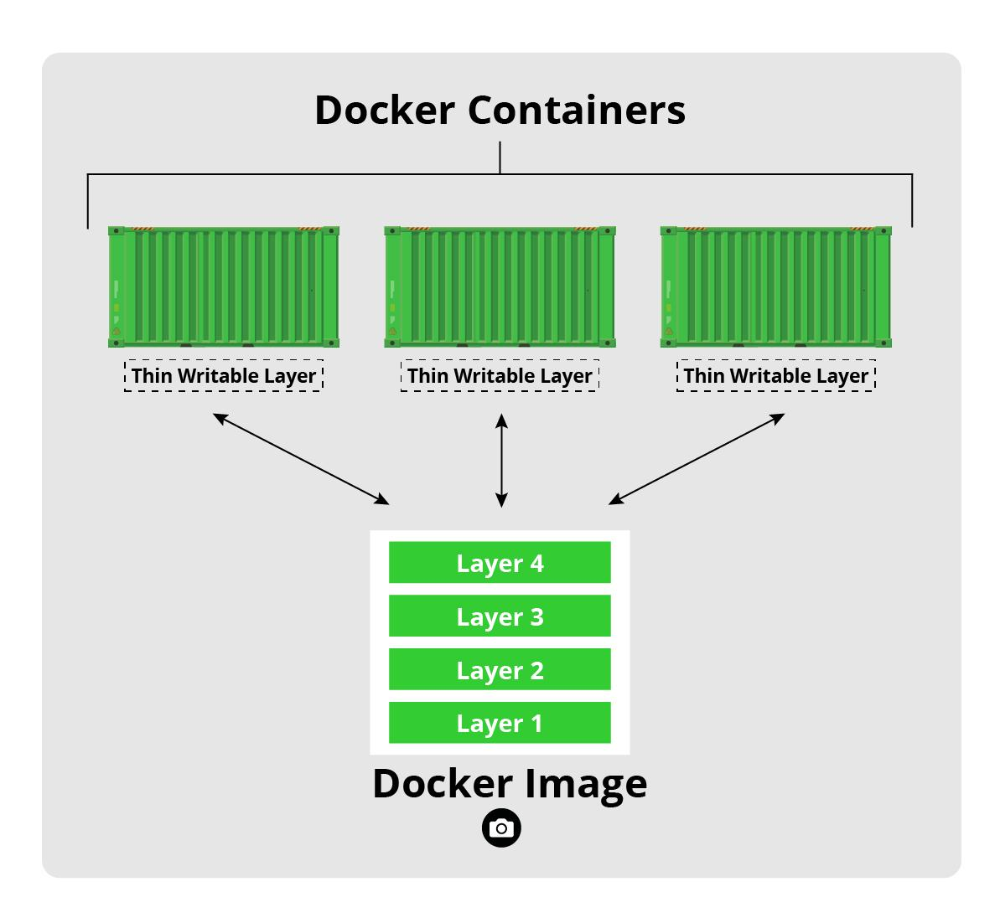
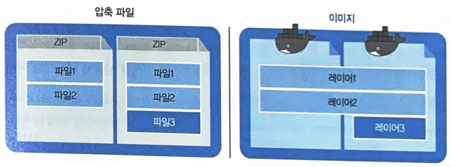

#### [back](../../README.md) &nbsp;&nbsp; | &nbsp;&nbsp; write by [sangcho][sangcho]

# 1. 컨테이너

> 이 글은 그림으로 공부하는 마이크로 서비스 구조를 참고하여 기록하였습니다.

 

    

## 1. 컨테이너란?

#### 1.1. 개념

- 애플리케이션과 관련 의존 관계를 포함하고 있는 소프트웨어 패키지
- 해당 패키지를 다양한 환경(OS, 하드웨어가 다른)에서 실행할 수 있게 해줌.

#### 1.2. 장점
- 애플리케이션을 환경에 의존하지 않고, 안정적으로 실행 가능.
  - 환경 변수 및 의존 관계가 환경마다 다르기 때문에 애플리케이션이 다르게 동작하는 상황이 발생
    - 개발환경 -> 테스트 환경 or 개발환경 -> 프로덕션 환경으로 컨테이너를 이동하는 경우
    - 온프레미스 환경 -> 클라우드 환경으로 이동하는 경우
  - 컨테이너는 환경 차이에 영향을 받지 않고 이동성이 높음 (이 모든것이 포함이 되어 있기에)
- 하나의 서버 리소스를 효율적으로 사용 가능.
  - 하나의 물러서버, VM 리소스를 효율적으로 사용 가능.
  - 각 컨테이너가 호스트 OS를 공유 -> 컨테이너의 시작속도가 빠름.
  - VM 이미지모다 크기가 작음 -> 배포 속도 빠름.
- 컨테이너 구성 파일을 배포 작업의 일부로 사용 가능.
  - 파일 배치 방법의 순서가 기입된 구성 파일(Dockerfile)을 기반으로 작성 -> 컨테이너 실행 시점에 필요한 파일이 필요한 위치에 존재하는 상태로 사용 가능(?)

  #### 1.2. 단점
- VM과 달리 컨테이너는 호스트 운영체제 리소스의 제어된 부분을 이용하고, 따라서 요소들이 VM 수준으로 엄격히 격리되지 않음.
- 스테이트리스(stateless)이며, 불변적(immutable)임. 이미지는 기본적으로 일단 생성되면 변경되지 않지만 컨테이너 인스턴스는 일시적(transient)이다. 인스턴스가 시스템 메모리로부터 제거되면 이는 영원히 사라짐.

## 2. 애플리케이션의 분리

#### 2.1. 애플리케이션이 공통으로 사용하는 것
- OS 리소스 
  - 네트워크
    - 프로세스 A -> 8080 포트를 Open -> 프로세스 B -> 같은 포트 사용 불가능. 
  - 파일시스템
    - 프로세스 A -> 특정 파일 시스템 변경 -> 프로젝트 B -> 변경된 특정 파일 확인  가능.

#### 2.2. 애플리케이션 단위로 분리해서 사용하는 것
- OS 리소스
  - 가상 주소 공간
    - 각 프로세스가 독자적으로 가지고 있는 메모리 영역 
    - 프로세스 A와 프로세스 B는 서로의 가상 주소 공간을 모름 -> 접근 불가능

## 3. 프로세스, 컨테이너, VM 비교

    

#### 3.1.프로세스

- 호스트 OS에서 직접 생성 및 관리 
  - 윈도우 or Mac에서 애플리케이션을 실행 했을때
- 실행중인 프로그램의 인스턴스.
- 메모리와 데이터 구조 집합으로 구성.
- 호스트 OS 레벨에서 기본 분리가 거의 없으며, 주로 분리된 메모리 공간과 사용자 권한만 있음.

#### 3.2. 컨테이너
- 호스트 OS에서 직접 생성 및 관리 + 컨테이너를 실행 with 컨테이너 엔진
- 자원 사용이 제한된 OS의 격리(분리)된 영역.
- 개인 루트 파일 시스템과 프로세스 네임스페이스로 제한된 프로세스들의 분리된 그룹.
- 프로세스가 자신의 개별 장치에서 실행되는 것처럼 행동할 수 있는(pretend) 몇 가지 훌륭한 커널 기능을 가진 프로세스 그룹
  - namespaces: 컨테이너가 완전히 별개의 장치인것처럼 보이고 느껴지도록 하는 기능
  - cgroups: 커널에서 프로세스를 그룹화하고 해당 그룹에 대한 리소스를 제한하는 방법
  - capabilities: 프로세스에 대해 활성화 또는 비활성화 할 수 있는 수퍼유저 권한 목록
- 자체 OS인 것처럼 가장하며, 분리된 환경에서 프로세스 그룹을 실행
- 즉, 컨테이너를 만들기 위해 cgroups을 사용하여 프로세스를 namespaces로 그룹화
- 프로세스(또는 프로세스 그룹)이지만 일반 프로세스보다는 OS로부터 분리(격리)되는 레벨이 높음.
- VM보다는 분리 수준이 낮으며 보안 수준이 낮음.

#### 3.3. VM
- 하이퍼바이저가 설치
  - 단일 하드웨어에서 여러 다른 가상 머신을 호스팅할 수 있는 프로그램
  - 컴퓨터(물리적 머신) 1대에 다수의 운영체제를 동시에 실행할 수 있도록 해주는 소프트웨어.
  - 호스트 하드웨어의 프로세서, 메모리 및 리소스가 있는 것처럼 보이기 때문에 가상 머신 또는 운영 체제 각각은 자체 프로그램을 실행 할 수 있음. 이러한 리소스를 가상 시스템에 할당 하는 프로그램.
  - [참고][참고]
- 각 VM은 독자 OS(게스트 OS)를 가지며, 그 위에서 프로세스가 실행.
- 호스트의 OS와 완전히 분리되며 하드웨어만을 공유.
- 더 분리되고 안전하지만 자체 OS를 실행하는 데 더 많은 호스트 자원을 사용.
- 동일한 호스트 시스템에서 서로 다른 운영 체제를 실행하고 완전히 분리된 환경에서 여러 애플리케이션을 실행할 수 있는 방법을 제공

## 4. 컨테이너를 지탱하는 기술

    

#### 4.1. 리눅스 네임스페이스

    

###### 4.1.1 개념

- 프로세스 간에 전역 시스템 리소스를 분리하는 커널의 기능
- 같은이름이라도 네임스페이스가 다르면 다른 것으로 간주 -> 이름 충돌을 방지
- 글로벌 시스템 자원을 추상화함으로써 네임스페이스 내의 프로세스에 글로벌 자원의 분리된 인스턴스가 있는 것처럼 보이게 함.

###### 4.1.2 종류

- Cgroup: 루트 디렉토리를 분리.
- IPC: 프로세스간 통신 분리.
- PID: 프로세스 ID 분리
- Network: 네트워크 스택을 분리
- Mount: mount point를 분리
- User: 사용자 및 그룹 정보 분리
- UTS: 호스트명 및 NIS 도메인 명 분리.

###### 4.1.3 활용

P129쪽 참고.

#### 4.2. cgroups

    

###### 4.2.1 개념

- 프로세스를 그룹화하여 사용할 수 있는 리소스를 제한하는 커널의 한 기능.
- CPU나 I/O 등의 리소스를 통일해서 관리하고 계층적으로 정리 함.
- 왜 필요할까? '특정 컨테이너가 시스템 전체 CPU 리소스 중 최대 50%를 사용해도 된다' 라는 기능까지 네임스페이스 기능으로 실현할 수 없기 때문에.

###### 4.2.2 종류

- Cgroup: 네임스페이스 리소스 관리.
- IPC: 프로세스간 통신.
- PID: 프로세스 ID
- Time: 시간 정보
- User: 사용자 및 그룹 정보
- UTS: 호스트명 및 NIS 도메인 명 관리.

###### 4.2.3 활용

## 5. 컨테이너의 역사
P134쪽 참고.

## 6. 컨테이너 이미지

#### 6.1. 개념

- 애플리케이션을 실행할 때 필요한 모든 것이 담긴 **소프트웨어 패키지**

#### 6.2. 도커 이미지

    
    

- 여러개의 읽기 전용 '레이어'로 구성, 개별 레이어는 재사용이 가능.
  - 왜 개별 레이어가 필요할까? 
  - 도커 이미지는 컨테이너를 실행하기 위한 모든 정보를 가지고 있기 때문에 보통 용량이 수백 MB임
  - 만약 이미지의 불변성 때문에 현재 이미지에 수정사항이 생겨 파일을 단 하나 추가된 이미지를 새로 다운로드 받아야 한다면, 처음부터 받아야 할까?
  - 이를 해결하기 위해 레이어를 사용 -> 유니온 파일 시스템을 이용하여 여러개의 레이어를 하나의 파일시스템으로 사용.
  
  

    
  

  - 압축파일과 비슷하지만 하나 다른점이 있다면 이미지는 레이어를 공유
  - 레이어 공유로 인해 파일 시스템에서 차지하는 전체 용량 감소

- 컨테이너 레이어 
  - 컨테이너를 실행한 후 설정을 변경하거나 원래 이미지를 수정할 때 사용되는 공간.
  - 이미지를 수정한 후에 처음으로 대상 파일이 컨테이너 레이어로 복사 -> 카피 온라이트 방식을 사용
- 이미지 레이어
  - 컨테이너를 만드는 '압축파일'
  - 도커 컨테이너를 만들기 위한 모든 정보를 가지고 있음.
  - 한 번 만들어지면 이미지 내의 정보는 절대 변하지 않으며, 이미지를 통해서 컨테이너가 만들어짐.
  - 이미지는 컨테이너를 만들어도 사라지지 않으며 여러 개의 컨테이너를 만들 수 있음.
- 스토리지 드라이버
  - 레이어들 사이의 상호작용을 정의.
- Dockerfile 내에 이미지 작성순서를 기록.
- 이미지가 변경 될때마다 신규 레이어가 추가.

## 7. 유니온 파일 시스템

 

    
  

#### 7.1. 개념
- 여러 개의 파일 시스템을 하나의 파일 시스템에 마운트 하는 기능.
- 여러 파일 시스템을 하나로 합치다보면 중복되는 파일이 있기 마련인데, UFS에서는 이 경우 나중에 마운트된 파일로 덮어씀.
- 도커에서는 이미지를 세분화(레이어)하여 관리하고, 공통 레이어는 재사용이 가능할 수 있도록 함 -> 이러한 레이어들을 겹쳐서 하나의 가상이미지로 보여주는 기술.
- 도커에서는 레이어가 크게 컨테이너 레이어(상위)와 이미지 레이어(하위)로 구분.
  - 기존 레이어(하위 레이어) 위에 새로운 레이어(상위 레이어)가 쌓일 경우
    - 하위 레이어는 읽기 전용 상태가 됨.
  - 상위 레이어에서 하위 레이어에 쓰기 작업을 수행할 경우
    - 하위 레이어를 **복사**하여 사용(CoW)하기 때문에 상위 레이어에서는 하위 레이어에 아무런 영향을 주지 않음.
- 컨테이너가 파일 시스템에 쓰기 작업을 수행할 경우, 실질적으로는 하위 레이어의 **복사본**에 해당 작업을 수행 -> 서로 다른 컨테이너가 하위 레이어를 공유하고 있어도 서로 독립적인 파일 시스템 운용이 가능.

---

<strong><참고자료></strong>

[책] [#그림으로 공부하는 마이크로 서비스 구조][그림으로공부하는마이크로서비스구조] - 다루사와 히로유키 지음 - 
[사이트] <https://velog.io/@wkdwoo/Container-Process-%EA%B7%B8%EB%A6%AC%EA%B3%A0-VM/>  
[사이트] <https://velog.io/@geunwoobaek/%EC%BB%A8%ED%85%8C%EC%9D%B4%EB%84%88-%EB%B0%8F-%EB%8F%84%EC%BB%A4-%EA%B0%9C%EB%85%90%EC%A0%95%EB%A6%AC>  
[사이트] <https://hyeo-noo.tistory.com/340/>  
[사이트] <https://velog.io/@koo8624/Docker-%EC%9C%A0%EB%8B%88%EC%98%A8-%ED%8C%8C%EC%9D%BC-%EC%8B%9C%EC%8A%A4%ED%85%9C-Union-File-System/>  
 
---

##### 컨테이너 end

[그림으로공부하는마이크로서비스구조]: http://www.yes24.com/Product/Goods/111090165?pid=123487&cosemkid=go16600967225125417&gclid=CjwKCAiAmuKbBhA2EiwAxQnt7wiLm4muh4dSpMTm6uRoMe1c8NRvwC6LLp_gwg6L5Mo9trXbgCwm7BoCbqoQAvD_BwE
[sangcho]: https://github.com/SangchoKim
[taeHyen]: https://github.com/rlaxogus0517
[sangkyeng]: https://github.com/sksk713
[참고]: https://medium.com/@su_bak/os-%ED%95%98%EC%9D%B4%ED%8D%BC%EB%B0%94%EC%9D%B4%EC%A0%80-hypervisor-%EB%9E%80-a8ae266fda00
