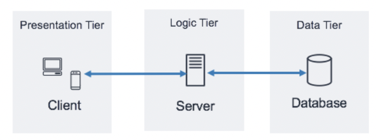
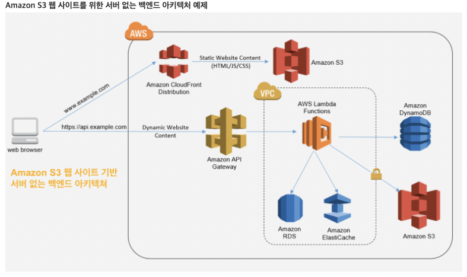
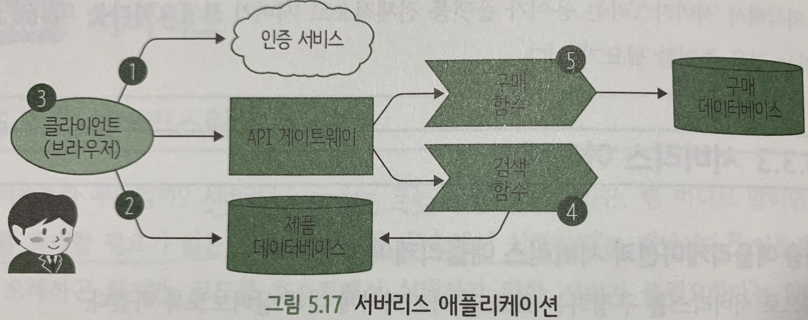

#### [back](../../README.md) &nbsp;&nbsp; | &nbsp;&nbsp; write by [taeHyen][taeHyen]

# 7. 데이터 결합

> 이 글은 그림으로 공부하는 마이크로 서비스 구조를 참고하여 기록하였습니다.

 

# 서버리스(Serverless)

## 서버리스란?

> [4장 마이크로서비스 배포 패턴 파트 참고](https://github.com/ZIPJUNG/Micro-Service/blob/main/contents/04.마이크로서비스패턴/7.배포패턴.md)
> 

애플리케이션 실행에 필요한 클라우드 리소스를 동적으로 할당한 서비스. 서버가 필요없다는 뜻이 아니라 클라우드상에 존재하는 서버. 

**서버 구축, 유지/관리, 업데이트, 확장, 용량 관리 등에 시간과 리소스를 투입할 필요가 없다.**

하지만 스스로 관리해야하는 서버나 컨테이너가 없이 이벤트(트리거)에 따라 동작하는 수준의 함수로 구성됨.

개발자가 개발에 집중 할수 있도록 구성됨

## 이용 대상

1. 개발자 - 개발자는 서버리스 플랫폼에서 실행되는 코드를 작성하고 이런 장점(서버 신경X)을 즐기는 입장.
2. 플랫폼 제공자 - 내/외부 고객용으로 서버리스 플랫폼을 배포 및 제공.
    1. 외부 고객 - 클라우드 벤더
    2. 내부 고객 - 자사 내의 쿠버네티스 환경상 서버리스 구조 도입하여 개발자에게 제공하는 형태

위 대상으로 보았을때 서버리스는 `개발자` 대상이라고 봐도 무방하다.

## 아키텍처

### 3계층 애플리케이션(**3-Tier Architecture of Web Application)**

    

1. **Presentation Tier(Client) - 일반 사용자가 직접 액세스 할 수 있는 프레젠테이션 계층**
    
    콘텐츠를 HTML/JS/CSS 형식으로 브라우저에 전송하는 계층(React, ..)
    
    모든 HTTPS 지원 클라이언트 또는 장치와 통신할 수 있으므로 프레젠테이션 계층은 다양한 형식(데스크톱 어플리케이션, 모바일 앱, 웹페이지, IoT 장치 등)을 유연하게 수행 할 수 있다.
    
2. **Logic Tier(Application) - 비즈니스 로직이 실행되는 비즈니스 로직 계층**
    
    ex) 어플리케이션 서버를 사용하고 어플리케이션에 대한 비즈니스 논리를 처리하는 계층(C#,Java,Python,..)
    
3. **Data Tier(Database) - 데이터 스토리지 계층**
    
    응용 프로그램 데이터에 대한 액세스를 제공하는 데이터베이스 관리 시스템(MySQL, Postgres,..)
    

### 서버리스 애플리케이션

    

    

1. 애플리케이션 서버에서 인증 부분 서비스를 제외하고 범용적인 외부 서비스 사용 가능
2. 클라이언트가 DB에 직접 접속 허용
3. 무거운 처리(검색 기능)은 서버 측 처리. 단 애플리케이션을 서버 상에 실행하는 것이 아닌 이벤트 단위로 실행

서버리스에선 애플리케이션 로직의 일부에 `외부 서비스(Baas)`를 이용한다.

서버 측 컨트롤러 대신에 클라이언트 측에서 정적 플로우와 동적 콘텐츠 생성이 이루어짐.

또한 비지니스 로직을 실행하는 커스텀 코드의 주기가 짧아 단일 HTTP 요청/응답 주기에 가깝다.(`비지니스 로직 이벤트 주도 서비스(Faas)`)

## BaaS와 Faas

### Baas(Backend-as-a-Service)

애플리케이션 핵심 기능의 일부를 외부 API로 대체

ex) DB서비스 - `Firebase`, 인증서비스 - `Auth0`

### FaaS(Functions-as-a-Service)

개발자는 이벤트나 HTTP 요청에 의해 실행되는 함수를 사용해서 애플리케이션 코드를 실행 및 관리

개발자는 작은 코드 단위를 FaaS에 배포해서 필요에 따라 개별 처리로 실행 

ex) `AWS Lambda`, `Azure Functions`, `Google Cloud Functions`

공통적으로 서버나 인프라 관리를 할 필요가 없고, 확장도 자동으로 이루어진다.

일부는 FaaS만 서버리스라 부르는 경우도 있지만, 엄밀히 말해서 BaaS와 FaaS를 합쳐서 서버리스 플랫폼이라 한다.

## 사용 예

서버리스가 유효한 경우

- 비동기, 병행, 독립된 작업 단위로 병렬화하기 쉬운 작업
- 요구 빈도가 낮으면서 산발적인 작업
- 확장 요건 범위가 넓고, 예측 불가능한 작업
- 스테이트리스(Stateless)이고, 생명주기가 짧은 작업(batch job)
- 비지니스 요건이 빈번하게 변화하고, 개발도 그게 맞춰 빠르게 진행되어야하는 작업

> **스테이트리스(Stateless)**
[클러스터](https://cloud.google.com/kubernetes-engine/docs/how-to/creating-a-container-cluster?hl=ko) 또는 영구 스토리지에 데이터 또는 애플리케이션 상태를 저장하지 않는 애플리케이션
ex)콘텐츠 전달 네트워크(CDN), 웹, 프린트 서버
> 

1. **멀티미디어 처리**
    
    새로운 파일을 업로드할 때 변환 처리하는 함수
    
    aws의 `S3` 같은 객체 저장소 서비스에 업로드한 경우 이벤트가 실행돼서 영상의 썸네일을 생성하고, 객체 저장소 패킷이나 DB에 저장하는 `함수`
    
2. **DB 변경 관련 Trigger**
    
    기존 SQL 트리거와 비슷한 기능, DB 메인 처리와 병행 처리
    ex) DB 내의 데이터 변경(테이블 데이터 삽입 등), 외부 서비스 호출(이메일 전송 등) 등의 비동기 로직 실행 함수
    
3. **IoT 센서 메세지**
    
    IoT와 같은 네트워크를 접속하는 자율형 장치가 증가하여, 대량의 트래픽 발생이 생겨 HTTP보다 가벼운 프로토콜이 사용하기 시작함.
    
    서버리스 기능은 IoT에서 MQTT 메세지를 효율적으로 관리하고 필터링할 수 있다.
    
4. **대규모 스트림처리**
    
    비트랜잭션형, 비요청/응답형의 예로 무한하게 발생하는 메세지의 스트림 내에 데이터를 처리하는 경우.
    
    `함수`는 메시지의 소스에 접속 가능하며, `메시지`는 이벤트 스트림에서 읽어서 처리함.
    
    대부분의 경우 스트림 처리에서는 NoSQL 또는 Inmemory DB에 있는 객체 세트와 데이터를 비교하거나 스트림에서 데이터를 집약해서 객체 또는 DB에 저장할 필요가 있다.
    
5. **배치 잡(batch job) 및 스케줄 테스트**
    
    비동기적인 방법으로 하루에 몇 분 동안만 부하가 매우 높은 병렬 계산, 입출력, 네트워크 접속시 서버리스가 최적. 왜냐하면 잡이 실행되는 동안 필요한 리소스를 효율적 관리가 가능하고, 배치가 이루어지지 않는 동안에는 비용 발생이 일어나지 않음.
    
6. **HTTP REST API와 웹 애플리케이션**
    
    기존 응답 요청형 작업은 정적 웹사이트든, js나 python 같은 언어를 사용해서 필요시 마다 응답 생성하는 경우든 서버리스에 적합하다. 기존 jsp와 같이 JVM을 실행하는 등 지연이 발생 했음.
    
7. **CI(Continuous Integration) 파이프라인**
    
    기존 CI 파이프라인에선 잡을 디스패치하기 위해서 아이들(idle: 프로세스가 실행하고 있지 않은 상태) 상태에서 대기하고 있는 워커 노드 풀이 존재했음. 
    
    서버리스는 미리 호스트를 준비하지 않아도 되어 비용 절감이 가능하다.
    

## 장/단점

### 장점

- **`비용 절감`**
    
    서버리스에 의해 서버 관리, DB 관리, 인증 등의 애플리케이션 로직을 외부에 맡길수 있음.
    
    H/W, 네트워크 인프라 비용 절갑과 개발자 인건비 절감.
    
- **`BaaS`**
    
    서버나 OS 뿐만 아니라 ‘*애플리케이션 컴포넌트*’ 자체가 상품화 된다.
    
    기존엔 이런 기능을 독자적으로 개발, 운영 시 인건비가 소비 되었음
    
    예1) Auth0와 같은 인증을 BaaS로 사용할 경우, 어떤 애플리케이션에도 공통 적용할 수 있는 계정 생성, 로그인, 패스워드 관리, 타 인증 제공사와의 결합 사용 가능
    
    예2) 모바일 단말기 간 데이터를 실시간 동기화 기능을 컴포넌트로 사용이 가능함.
    
- **`FaaS`**
    
    IaaS는 ‘사용한 만큼 과금’이라고 되어있지만, 비지니스 로직 처리 하지 않는 시간에도 VM실행이 되어 요금은 부과됨. PaaS도 배포 후 앱이 실행 중인 상태가 돼서 명시적으로 정지하지 않는 한 요금 부과.
    
    FaaS는 실제로 처리한 시간만 과금 됨 → 연쇄작용으로 불필요한 요청을 줄이기 위해 코드 최적화를 실시하게 됨(안하면 불필요한 과금처리가 발생할 가능성이 높음).
    
- **`쉬운 유지/관리`**
    
    FaaS에서는 함수를 배포한 후에는 설정을 변경할 필요 없이 리소스를 자동으로 확장해준다.
    
    IaaS에도 자동으로 리소스를 확장하는 기능이 있지만, 인프라를 의식한 설정 및 관리가 필요함.
    

### 단점

1. **서버리스 고유의 제약**
    - **`상태 관리의 번잡함`**
        
        서버리스 컴포넌트는 DB처럼 상태를 명시적으로 관리하는 것을 제외하고 기본적으로 스테이트리스다. 상태가 필요한 경우는 Inmemory DB처럼 BaaS 컴포넌틀 사용해야한다. 
        
        1. 로컬 메모리나 파일 처리하는 것처럼 간단하지 않다.
        2. 지연시간도 발생
        3. 서버리스로 마이그레이션하는 경우 필요에 따라 스테이트리스 형태에 맞추어 재설계 필요
        4. BaaS별 특성에 맞추어 데이터 일관성 고려
    - **`지연 시간 발생`**
        
        특정 BaaS에 대한 지연시간이 발생한다고 해서 프로토콜을 더 빠른 것으로 변경하거나 컴포넌트 간 네트워크 토폴로지(물리 머신상에 배치하는 경우)를 변경할 수 없다.(?)
        
    - **`로컬 테스트의 어려움`**
        
        현재는 오픈 소스 중심으로 대부분 DB나 메세지 큐 등의 서비스가 컨테이너 이미지로 제공중.
        
        즉, 컨테이너 환경만 있으면, 네트워크가 연결돼 있지 않아도 로컬에서 대부분 개발 및 테스트가 가능함.
        
        그러나, 서버리스에서는 함수 기반의 단위 테스트까지만 가능, 서비스를 사용하는 통합 테스트는 어려움.
        
2. **현재구현에 의한 제약**
    - **`콜드 스타트`**
        
        서버리스 코드를 실행하는 환경을 플랫폼에 의존.
        
        최초 접속이나 한동안 접속이 없었다가 접속시, 또는 컨테이너 수가 확장 기능에 의해 바뀐 직후에 접속시 초기화 처리 등으로 인해 컨테이너가 바로 실행되지 않음. 
        
        → 지연시간 발생, 실시간 요구 환경시 매우 심각한 문제 발생(저자는 플랫폼 제공사의 최적화 노력에 의해 개선되리라 믿는다고한다…)
        
        > **콜드 스타트 (cold start)**
        시스템 또는 그 일부가 재시작될 때 내부 객체의 초기화가 필요하다는 등의 이유로 일반적인 동작을 하지 못하는 문제를 의미
        > 
    - **`툴이나 실행 환경의 제약`**
        
        애플리케이션 전체를 배포하고자 할 때 컨테이너 오케이스트레이션으로 한번에 배포하는 방식을 제공해주는 툴이 현재는 존재하지않다.
        
        FaaS 실행 환경시 이용할 수 있는 리소스(CPU, 메모리, 실행 환경)가 매우 제한적.
        
        또한 서비스 전체를 일괄적으로 감시할 수 있는 감시 툴은 현재 많지 않다.
        
        로컬에서 테스트가 제한되어 원격 실행 환경에서 디버그 해야함.
        
    - **`벤더 종속(vendor lock-in)`**
        
        FaaS의 함수 구현은 플랫폼마다 달라서 기본적인 호환성이 없다.
        
        해당 플랫폼에서 이용할 수 있는 BaaS나 타 서비스도 어느정도 제한되어짐.
        
        마이그레이션 비용과 운영 비용이 매우 커짐.
        
        이건 서버리스 특유 제약이 아니라, 쿠버네티스와 같은 ‘*업계 표준 사양*’이 없다는 점.
        
        가능성으로 케이네이티브([Knative](https://knative.dev/docs/))나 쿠베리스([Kubeless](https://github.com/vmware-archive/kubeless)) 처럼 쿠버네티스 상에서 실행하는 프레임워크가 표준이 된다면 쿠버네티스가 가진 장점을 활용하면서 서버리스 제약도 줄일 수 있다.
        
 

## **서버리스는 어떤 서비스나 조직에 적합할까?**

서버리스는 새로운 아이디어를 빠르게 테스트해야 하는 조직에 적합하다. 그에 대한 예로 스타트업의 경우를 보면, 시도와 실패를 반복하며 구현한 기능을 서비스에 빠르게 녹여 신속히 출시해야 시장에서 경쟁력을 갖출 수 있다. 

단기간 이벤트성 트래픽을 감당해야 하는 경우에도 서버리스가 효과적이다. 필요할 때 동적으로 자원을 할당받아 사용하기 때문에 급격한 트래픽 변화에 유연하게 대응할 수 있다.

또한, 예상되는 반복적인 배치(batch) 처리 형태의 기능이 서버리스를 활용하기에 적절하다. 예를 들어 실시간 라이브 동영상 스트리밍에 대한 로그 분석, 음성이나 텍스트를 기반으로 학습된 데이터를 제공하는 인공지능 기능 등 반복적으로 타 시스템과 연계하여 비즈니스 요구사항에 맞는 결과를 도출하는 기능에 특화되어 있다.

- 관리보다 개발에 집중하여 서비스 출시를 앞당김
- 함수 단위 로직으로 코드 유지보수나 기능 추가에 효율적
- 이벤트 기반 실행으로 경제적이며 유연한 대응 가능
- 반복적으로 타 시스템과 연계하여 비즈니스 인사이트를 도출할 때 유용

[참고]

1. [3-Tier Architecture 정의 및 구성방식](https://sunrise-min.tistory.com/entry/3-Tier-Architecture-%EC%A0%95%EC%9D%98-%EB%B0%8F-%EA%B5%AC%EC%84%B1%EB%B0%A9%EC%8B%9D)
2. [AWS 한국 블로그 서버리스 아티](https://aws.amazon.com/ko/blogs/korea/serverless-architecture-by-korean-developers/)
3. [서버리스는 어떤 서비스나 조직에 적합할까?](https://cloudmt.co.kr/?p=3774)

<strong><참고자료></strong>

[책] [#그림으로 공부하는 마이크로 서비스 구조][그림으로공부하는마이크로서비스구조] - 다루사와 히로유키 지음 -

---

##### 서버리스 end

[그림으로공부하는마이크로서비스구조]: http://www.yes24.com/Product/Goods/111090165?pid=123487&cosemkid=go16600967225125417&gclid=CjwKCAiAmuKbBhA2EiwAxQnt7wiLm4muh4dSpMTm6uRoMe1c8NRvwC6LLp_gwg6L5Mo9trXbgCwm7BoCbqoQAvD_BwE
[sangcho]: https://github.com/SangchoKim
[taeHyen]: https://github.com/rlaxogus0517
[sangkyeng]: https://github.com/sksk713
