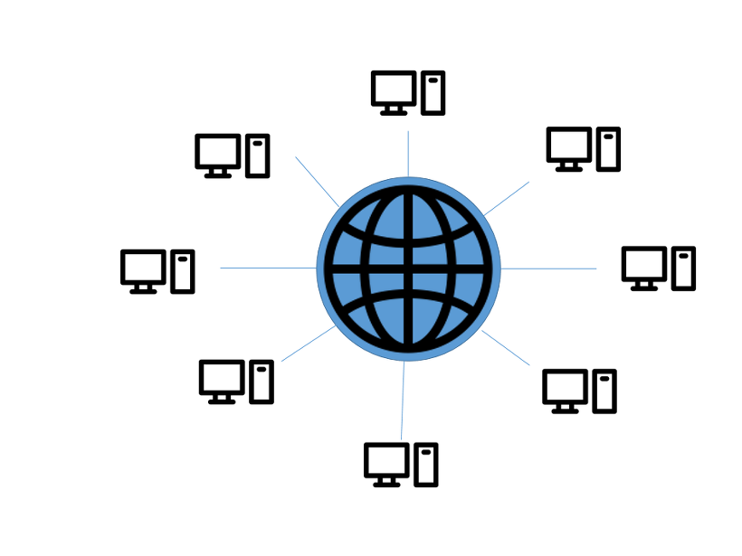
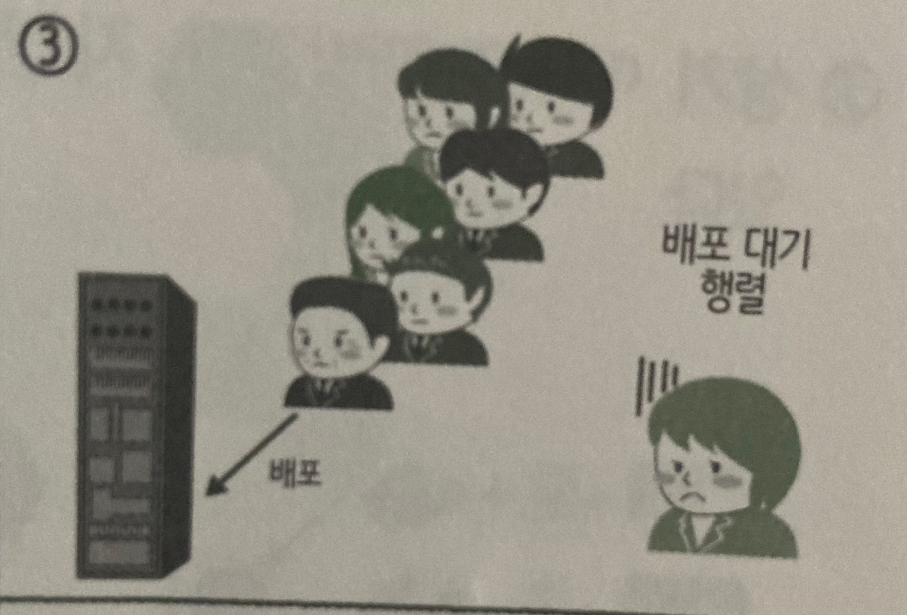
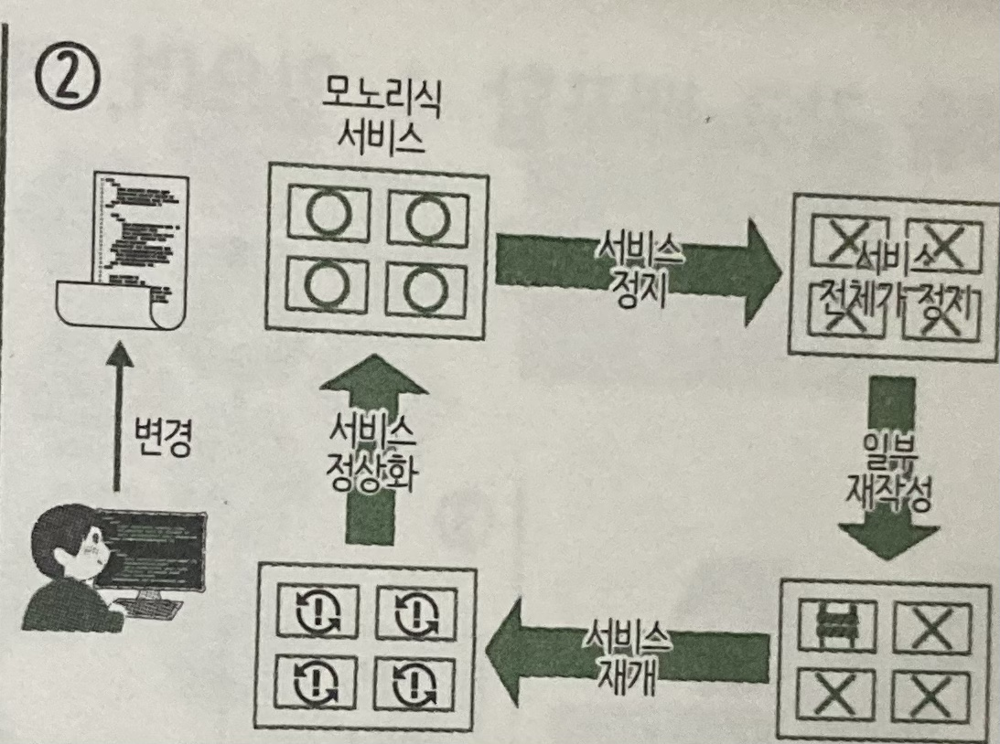
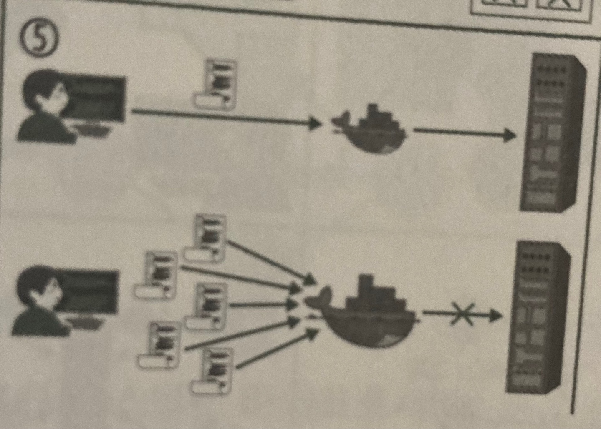
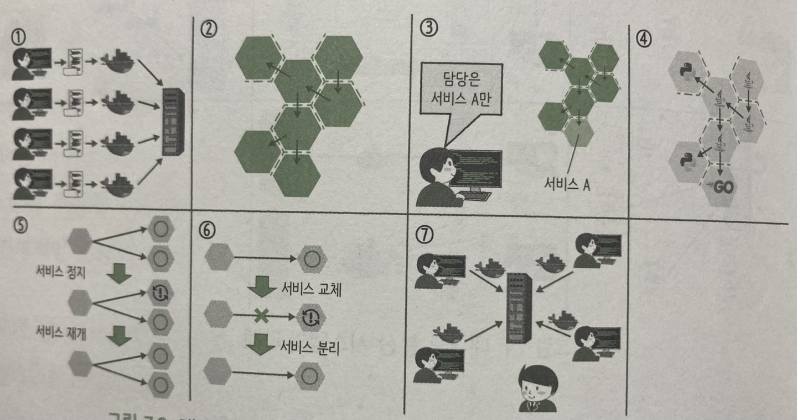
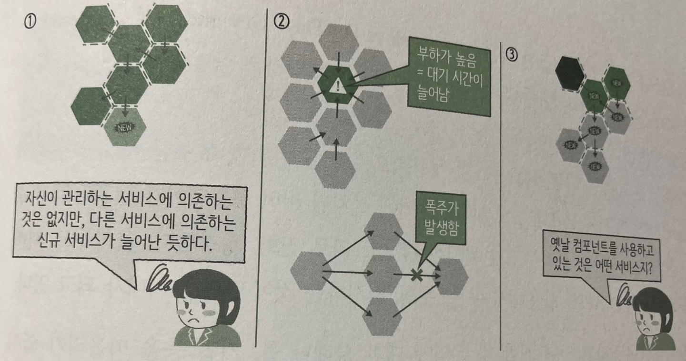

#### [back](../../README.md) &nbsp;&nbsp; | &nbsp;&nbsp; write by [sangcho][sangcho]

# 1. 마이크로서비스의 개발과 운영

> 이 글은 그림으로 공부하는 마이크로 서비스 구조를 참고하여 기록하였습니다.

 

  

## 1. 마이크로서비스 개발과 운영의 장점과 고려사항

#### 1.1. 분단 시스템이란?

  

###### 1.1.1 정의
- 여러개의 컴퓨터가 동일한 일을 처리하기 위해 협력하는 것, 하나의 공유 상태를 가지며 동시에 작동

###### 1.1.2 특징
1. 자원 공유 
  (1) 각 시스템이 통신망을 통해 연결되어 있으므로 유용한 자원을 공유하여 사용할 수 있음.

2. 연산 속도
  (1) 하나의 일을 여러 시스템에 분산시켜 처리함으로써 연산 속도가 향상됨.

3. 신뢰도 
  (1) 여러 시스템 중 하나의 시스템에 오류가 발생하더라도 다른 시스템은 계속 일을 처리할 수 있으므로 신뢰도가 존재.

4. 컴퓨터 통신 
  (1) 지리적으로 멀리 떨어져 있더라도 통신망을 통해 정보를 교환 가능.

###### 1.1.3 장점
1. 여러 사용자들 간의 통신이 용이.
2. 제한된 장치를 여러 지역의 사용자가 공유.
3. 중앙 컴퓨터의 과부하 감소.
4. 사용자는 각 컴퓨터의 위치를 몰라도 자원 사용 가능.
5. 업무량의 증가에 따른 시스템의 점진적인 확장이 용이.
6. 하나의 일을 여러 시스템이 처리함으로써 연산 속도, 신뢰도, 사용 가능도가 향상되고, 결함 허용이 가능.

###### 1.1.4 단점

1. 객체 간 의존 관계 파악이 어려워짐 -> 서비스 및 시스템 구조를 파악하기 어려움 -> 통일성을 잃기 쉬움.

  

2. 수정에 대한 의존 관계를 엄격하게 파악 필요 -> 개발자의 자신감 하락 + 개발팀 간의 커뮤니케이션 측면에서도 문제가 됨

  

3. 새로운 기능 추가 및 수정 -> 릴리즈 -> 버그 발견 -> 전체 릴리즈 중지

  

4. 용량이 거대함 -> 시간이 많이 걸림 -> 많은 공간 요구 -> 다른 환경으로의 이식성 하락

#### 1.2. 대규모 분산 시스템을 마이크로서비스로 구성한 경우의 장점
 

  

 1. 서비스 단위로 배포 가능 -> 버그 수정이나 기능 릴리즈가 쉬움
 2. DDD (도메인 주도 개발) 설계 이용 -> 서비스 간 의존 관계를 명시적으로 나눌 수 있음
 3. 각 서비스의 규모는 작아짐 -> 구축, 테스트, 배포를 적은 인원으로도 가능. 
 4. 각 서비스의 담당 범위가 확실 -> 기술 스택의 자유로운 개발 가능 -> 서비스의 최적인 기술 선택 가능 
 5. 약한 결합 -> 사용자에게 파급되는 장애 영향을 최소화 by 서킷 브레이커
 6. 약한 결합 -> 서비스 간의 결합이 약해져, 담당하고 있는 서로의 서비스에 영향 최소화 가능 
 7. 개발자의 자신감 업 -> 자신있는 배포 가능  

 Q. 서킷 브레이커란?  
 A. 누전 차단기라는 뜻을 지닙니다. 누전 차단기는 전기 회로에서 과부하가 걸리거나 단락으로 인한 피해를 막기 위해 자동으로 회로를 정지시키는 장치입니다. 서버에서 사용하는 서킷브레이커도 **외부 API 통신의 장애 전파를 막기 위해 장애를 탐지하면 외부와의 통신을 차단하는 역할**을 합니다.

#### 1.3. 대규모 분산 시스템을 마이크로서비스로 구성한 경우의 주의점

  

1. 각 마이크로는 단순 -> 하지만 동적 부품(서비스)이 늘어나므로 시스템 전체적으로는 파악이 어려워짐.
2. 서비스간 통신 구현 필요 -> 고려해야 할 사항이 많아짐(네트워크 폭주, 대기시간 등)
3. 타 서비스에 의존하는 경우 -> 모노리스지만 다른 접근법이 필요 (?)

---

<strong><참고자료></strong>

[책] [#그림으로 공부하는 마이크로 서비스 구조][그림으로공부하는마이크로서비스구조] - 다루사와 히로유키 지음 -
[사이트] <https://velog.io/@yeavov/distributed-systems>  
[사이트] <https://jess2.tistory.com/90>  
[사이트] <https://velog.io/@hgs-study/CircuitBreaker>  

---

##### 마이크로서비스의 개발과 운영 end

[그림으로공부하는마이크로서비스구조]: http://www.yes24.com/Product/Goods/111090165?pid=123487&cosemkid=go16600967225125417&gclid=CjwKCAiAmuKbBhA2EiwAxQnt7wiLm4muh4dSpMTm6uRoMe1c8NRvwC6LLp_gwg6L5Mo9trXbgCwm7BoCbqoQAvD_BwE
[sangcho]: https://github.com/SangchoKim
[taeHyen]: https://github.com/rlaxogus0517
[sangkyeng]: https://github.com/sksk713
