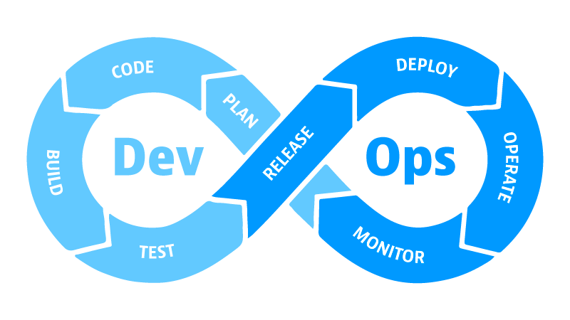
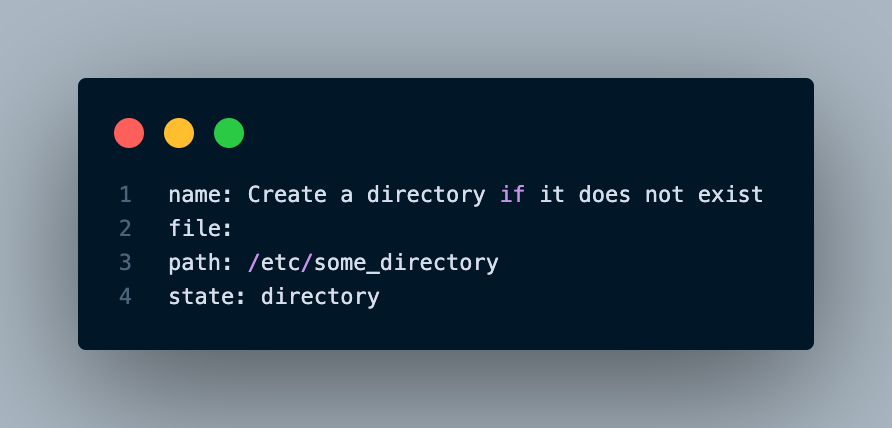
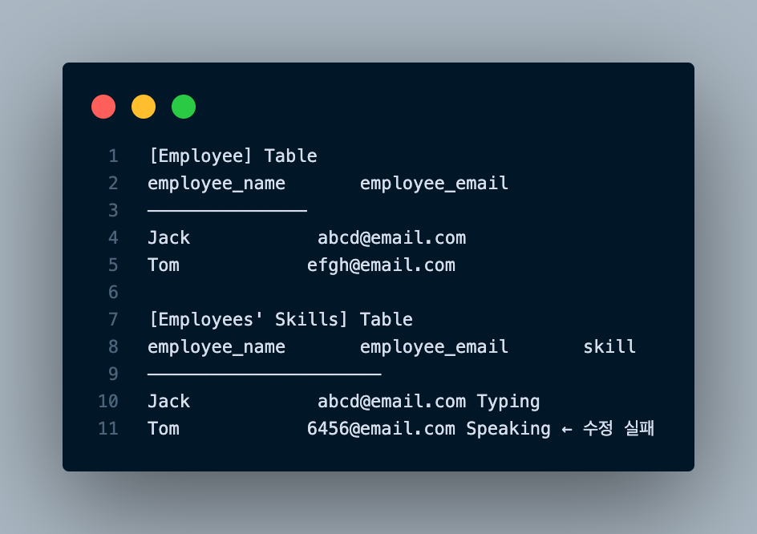

#### [back](../../README.md) &nbsp;&nbsp; | &nbsp;&nbsp; write by [sangcho][sangcho]

# 1. 마이크로서비스의 개발과 운영에 필요한 모범사례

> 이 글은 그림으로 공부하는 마이크로 서비스 구조를 참고하여 기록하였습니다.

 

## 1. 데브옵스

  

#### 1.1. 개념

- 개발(Development)과 운영(Operations)을 합친 용어. 
- 소프트웨어 개발자와 정보기술 전문가 간의 소통, 협업 및 통합을 강조하는 개발 환경이나 문화를 말함.

#### 1.2. 배경

###### 1.2.1 과거 조직

- 기획팀 : 상상력을 동원하여 서비스를 기획함.
- 개발팀 : 개발을 죽어라 함.
- 운영팀 : 개발팀이 반영한 내용을 반영(배포)하고 고객응대를 함.  

**문제**  
- 내가 맡은 일만 하고 퇴근하는 문화가 생겨 소통의 부재가 발생 -> 서로의 입장만 강조하는 상황이 생김.
- 운영은 개발의 미완성으로 인하여 배포가 원활하게 끝난 적이 거의 없음 -> 밤새 수정-> 반영만 반복하는 일이 자주 생김.

---

###### 1.2.2 약간 발전한 과거 조직

- 기획팀 : 상상력을 동원하여 서비스를 기획함.
- 개발팀 : 개발을 죽어라 함.
- **검증팀 : 개발된 내용을 눈에 불을켜고 검증함**.
- 운영팀 : 개발팀이 반영한 내용을 반영(배포)하고 고객응대를 함.  

**문제**  
- 검증 조직 등장 -> 개발의 오류가 줄어듬 -> VOC(고객의 소리)도 줄어듬.
- 개발과 검증간의 시간소요로 개발기간은 늘어남.
- 운영팀의 고질병인 휴먼에러가 수시로 발생.

---

###### 1.2.3 발전한 조직 (애자일)

- 모든 과정의 의견을 수시로 공유하여 누구나 참여하는 프로젝트로 진행.

**효과**  
- 개발이 기획에 참여 -> 산으로 가는 배를 만들지 않게 됨.
- 개발은 commit전 local Test를 실시.
- 검증은 개발을 포함하여 사용자 테스트 등으로 검증을 나누어 실시.
- 운영은 각 단계별(개발-검증-상용)로 구분하여 배포 자동화등의 업무 효율화.
- 모든 과정은 협업툴(레드마인, 맨티스, Jira 등)을 이용하여 소통함  

**문제**  
- 개발팀, 검증팀, 운영팀이 조직적으로 나눠져 있게 됨에 따라, 잘못된 소통이 발생 가능성.
- 능력자를 차지하기 위한 서로 팀간의 견제.

--- 

###### 1.2.4 발전하고 있는 조직 (데브옵스)

- 개발-검증-운영을 모두 포함하는 하나의 조직으로 구성.

**효과**  
- 소스의 형상관리를 통해 단계별로 같은 결과를 나타내게 됨 -> **“내 PC에서는 잘되는데?”** 를 없앰.
- 형상관리된 시스템을 이용하여 빌드 & 배포 과정을 자동화 하고 단순화 -> 누구나 이용할 수 있도록 함 -> 배포오류 줄임.
- Testcase를 공유 -> 누구나 체크될 수 있도록 함 -> 개발오류 줄임
- slack, trello 등의 다양한 소규모 소통 협업도구를 이용 -> 수시로 소통 -> 소통의 부재 줄임  

## 2. CI/CD (지속적 통합/지속적 전달)

  

#### 2.1. 개념

- 어플리케이션 개발부터 배포 때까지 모든 단계를 자동화를 통해 조금 더 효율적이고 빠르게 사용자에게 빈번히 배포할 수 있도록 만드는 것

#### 2.2. CI (지속적 통합)

###### 2.2.1 특징

- 코드 변경사항을 주기적으로 빈번하게 머지 필요.
  - 머지를 너무 안하면 새로운 기능을 개발하기 위해 코드를 작성하는 시간보다 머지 충돌을 해결하는데 더 오래 걸릴 수 있기 때문.
  - 기능을 어떻게 작은 단위로 나눠서 메인 레파지토리에 반영하거나, 작은단위로 나눠서 사용자에게 배포하는 등 작은 단위로 나눠서 개발하는 것이 중요함.

- 통합을 위한 단계(빌드, 테스트, 머지)의 자동화 필요.
  - 메인 레파지토리에 개발자들이 주기적으로 코드를 머지.
  - 자동으로 팀의 CI 스크립트를 통해 추가된 코드와 함께 빌드하고, 여러 테스트를 실행.

###### 2.2.2 장점
- 개발 생산성 향상
  - 주기적으로 머지를 하기 때문에 머지충돌을 피할 수 있어 개발 생산성이 올라감.
- 버그 수정 용이
  - 머지되는 코드들은 자동으로 빌드, 테스트가 되기 때문에 코드의 결함이 빠르게 발견 -> 수정 가능
- 코드의 퀄리티 향상
  - 모든 개발자들이 자신의 새 코드에 대해서 유닛 테스트를 포함시켜야 하기 때문.

#### 2.3. CD (지속적 제공 or 배포)

###### 2.3.1 특징

- 아티팩트를 배포할 환경을 구성해 테스트 -> 실제 환경에 적용하는 과정
  - 통합테스트 or E2E 테스트 포함.
  - AB 테스트, UI/UX 테스트 포함.
- 마지막 배포 단계에서 자동화
  - 개발자나 검증팀이 준비된 릴리즈가 정상적인지, 문제가 없는지 직접 검증 -> 사용자에게 배포해도 되겠다는 결론이 나면 수동적으로 배포함 (Continuous Delivery)
  - 릴리즈가 준비되자마자 자동으로 사용자에게 배포하도록 만들어 둠 (Contiuuous Deployment)

## 3. 깃옵스

#### 3.1. 개념

- 리포지터리인 Git을 중심으로 애플리케이션 개발은 물론 배포 및 운영 작업을 자동화하는 것. 
- 애플리케이션 코드, 인프라, 미들웨어 구성 정보 관리, 커밋과 승인을 트리거로 해서 빌드나 배포를 실시함.

#### 3.2. 특징

###### 3.2.1 선언형 모델

 

    

- 명령형 모델: 서버에서 작업을 자동화 할 떄 “ssh로 접속 → cd로 이동 → mkdir로 디렉토리 생성”
  - 간단하지만, 단점이 존재
    - 예외 상황 (이미 디렉토리가 존재, 권한 등) 을 모두 관리 필요 
    - 원격 대상에 대한 지식 (OS 종류에 따른 명령어 차이)
- 선언형 모델: 대상이 무엇이 되어야 하는지만 기술
  - 디렉토리가 이미 존재하는지 확인하거나 OS에 따라 바뀌는 명령어를 사용자가 알아야 할 필요가 없음 -> 위 예시는  ‘/etc/some_directory’ 디렉토리가 필요한 상황
  - 인프라를 포함한 애플리케이션 배포와 운영에 관련된 모든 것을 코드로 관리할 수 있음
  - 코드를 이용하여 언제든 똑같은 환경을 다시 만들어내거나 부분 소실 시 복원할 수 있음

###### 3.2.2 단일 진실 공급원 (SSOT)

    

- 단일 진실 공급원: 같은 데이터가 여러 곳에 있을 경우 문제를 일으킬 수 있으니, 한 곳에 두고 관리, 다른 곳에서 필요 시 참조만 하도록 하여 문제 해결.
  - “Employee”와 “Employees' Skills” 테이블 존재 
  - 각 레코드들은 Employee Name, Employee Email 정보를 중복해서 포함
  - ‘Tom’의 이메일 주소가 변경
  - 여러 개의 테이블의 레코드를 수정 필요 -> 하나라도 수정이 이루어지지 않을 경우 모순 상태 -> 조회하는 테이블에 따라 ‘Tom’ 이메일이 다르게 조회되기 때문에
  - 해결 방법: “Employees’ Skills” 테이블에서 Employee Email을 제거하고 employee_name를 이용해 “Employee” 테이블을 참조 -> Employee Email 정보는 오직 “Employee”라는 하나의 테이블에서만 관리
- 깃을 단일 진실 공급원으로 지정하고 오직 이 곳에서만 관리하도록 함.
  - 모든 운영 활동의 시작은 깃이므로 사람 혹은 시스템 간의 혼선을 최소화 가능

#### 3.3. 장점

###### 3.3.1 신뢰할 수 있는 정보의 공유
- 깃 이력을 보면 현재 상태는 물론 누가, 언제, 왜, 어느 곳을 수정했는지 쉽게 알 수 있음. 
- 지금까지의 모든 이력을 포함하고 있어 부가적인 문서 작업을 없애는 좋은 수단. 

###### 3.3.2 익숙한 절차
- “git commit → push → merge request → review → merge”, 개발자에게 굉장히 익숙한 절차 
- 애플리케이션 배포를 위한 별도의 절차를 만들거나 교육시킬 필요가 없음.
- 리뷰 절차를 통해 휴먼 에러를 조기에 발견하고 책임을 나눌 수 있음.

## 4. IaC(Infrastructure as Code)
## 5. 변경 불가 인프라

---

<strong><참고자료></strong>

[책] [#그림으로 공부하는 마이크로 서비스 구조][그림으로공부하는마이크로서비스구조] - 다루사와 히로유키 지음 - 
[사이트] <https://digndig.kr/dailylife/2021/07/06/Daily_Whatisdevops.html>  
[사이트] <https://www.samsungsds.com/kr/insights/gitops.html/>  

 
---

##### 마이크로서비스의 개발과 운영에 필요한 모범 사례 end

[그림으로공부하는마이크로서비스구조]: http://www.yes24.com/Product/Goods/111090165?pid=123487&cosemkid=go16600967225125417&gclid=CjwKCAiAmuKbBhA2EiwAxQnt7wiLm4muh4dSpMTm6uRoMe1c8NRvwC6LLp_gwg6L5Mo9trXbgCwm7BoCbqoQAvD_BwE
[sangcho]: https://github.com/SangchoKim
[taeHyen]: https://github.com/rlaxogus0517
[sangkyeng]: https://github.com/sksk713
