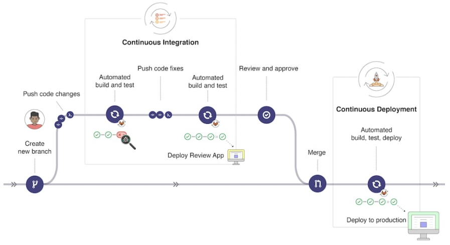
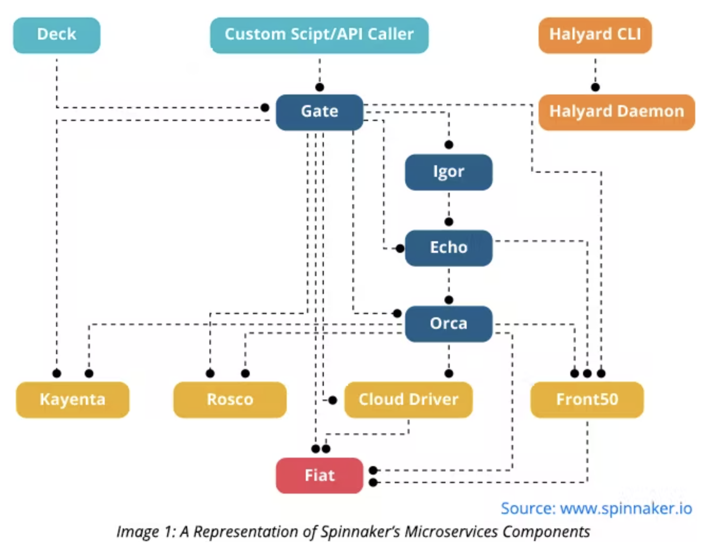
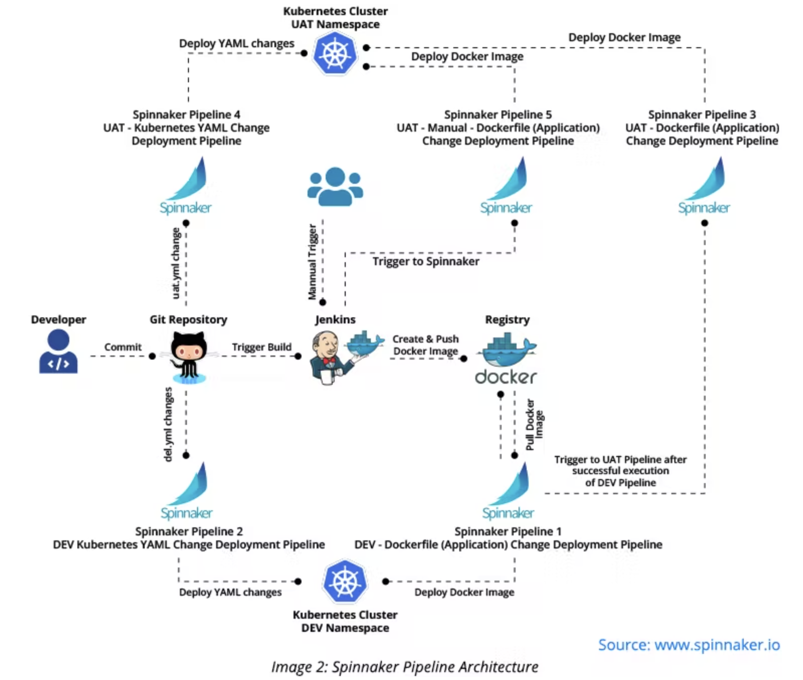

#### [back](../../README.md) &nbsp;&nbsp; | &nbsp;&nbsp; write by [taeHyen][taeHyen]

# 7. 데이터 결합

> 이 글은 그림으로 공부하는 마이크로 서비스 구조를 참고하여 기록하였습니다.

 

## 릴리스의 기본적인 흐름

릴리스 관리는 안전하고 신속하게 서비스를 릴리스하려면 서비스 전체의 일관성을 유지하면서 릴리스해야 한다.

### 릴리즈 vs 배포
- 릴리즈: 제품의 버전에 따른 사용자/ 외부 환경. 패키징된 단위의 제품
- 배포: 릴리즈된 환경을 외부로 배포

## 모노리스

단위 테스트 → 빌드 → 배포(개발) → 통합 테스트 → 배포(스테이징) → 성능 테스트 → 배포(운영)

### MSA

각 서비스 언제든 개별 배포

1. 개발 대상 레포 코드 + 컨테이너 이미지 풀(pull)
2. 소스 코드 추가, 변경, 컨테이너를 활용한 테스트
3. 개발 대상 레포에 코드 푸시(push)
4. 코드 리뷰(PR)
5. 코드 머지(Merge)
6. 컨테이너 이밎 주닙
7. 개발 환경에 릴리스
8. 테스트
9. 프로덕션 환경에 릴리스

## 파이프라인

프로세스 자동화를 위해 파이프라인 구축이 필요하다. 빌드와 릴리스 과정 중 사람의 손이 필요한 것은 코드 편집, 리뷰, 승인 정도까지.

### 기존 파이프라인

    

## 스피나커

**Netflix**에서 설계하고 개발한 오픈 소스 멀티 클라우드 CD. GCP, AWS, Azure와 같이 다양한 클라우드 공급자에 애플리케이션을 배포하는데 도움이됨.

다중 컨테이너 환경 관리의 단순성 때문에 쿠버네티스를 채택함.

    

- **Deck:** Spinnaker 도구와 상호 작용할 수 있는 사용자 인터페이스를 제공합니다.
- **Gate:** API 게이트웨이 역할을 합니다. 모든 API 요청을 서비스에 전달합니다.
- **Orca:** 다양한 임시 작업을 처리하고 단계와 함께 파이프라인을 관리합니다.
- **Clouddriver:** 클라우드 공급자를 호출합니다. Spinnaker와 클라우드 공급자 간의 통합 지점 역할을 합니다.
- **Front50:** 애플리케이션, 파이프라인 및 프로젝트의 메타데이터를 보존합니다.
- **Rosco:** 나중에 다양한 클라우드 공급자에 배포되는 이미지를 굽습니다.
- **Igor:** Jenkins 및 Travis CI와 같은 지속적인 통합 플랫폼을 통해 파이프라인을 트리거합니다.
- **Echo:** 이메일, SMS 및 Slack을 통해 알림을 보냅니다. 또한 Github 웹후크 및 Jenkins 웹후크와 같은 수신 웹후크를 담당합니다.
- **Fiat:** Spinnaker에 대한 인증 서비스 역할을 합니다.
- **Kayenta:** Spinnaker에 대한 자동화된 카나리아 분석을 제공합니다.
- **Halyard:** Spinnaker 설치, 업데이트 및 구성에 사용되는 구성 서비스입니다.

### 스피나커 아키텍쳐

    

배포용 파이프라인을 만들어 Blue-Green 배포, 카나리 배포, A/B 테스트 등 적용 가능.

## 플럭2/플래거?

쿠버네티스를 위한 GitOps(지속적 전달) 솔루션.

`쿠버네티스`:  YAML으로 관리

`Flux2`: ~~kubectl,~~ kubectl에 통합된 커스터마이즈 및 헬름(Helm), 깃허브, 하버(컨테이너 이미지 레지스트리) 등과의 연계가 쉬움.

### 스피나커와의 차이

GitOps를 실현하기 위해 소스 코드 레포 + 파이프라인(깃헙)를 가운데 배치하고 있는 것. 쿠버네티으세 배포하는 것은 깃헙 액션에서 제공하는 파이프라인을 사용. 반면 플러거는 배포에 특화된 툴로 이스티오,  링커드, AWS app mesh, NGINX 등의 서비스 메시 툴과 연계해 카나리 배포, A/B 테스트, 블루그린 배포 등의 배포 전략을 실현함.

- GitOps란?
    
    Git 리포지토리를 단일 정보 소스로 사용하여 인프라를 코드로 제공합니다. 제출된 코드에서는 [CI 프로세스를 확인하고, CD 프로세스](https://www.redhat.com/ko/technologies/cloud-computing/openshift/ci-cd)에서는 보안, [코드형 인프라(IaC)](https://www.redhat.com/ko/topics/automation/what-is-infrastructure-as-code-iac) 또는 애플리케이션 프레임워크에 설정된 기타 경계와 같은 요구 사항을 확인하고 적용합니다. 코드에 대한 모든 변경 사항이 추적되므로 업데이트를 손쉽게 수행할 수 있으며 롤백이 필요한 경우 버전 제어 기능도 제공됩니다.
    
    GitOps는 다음을 제공합니다.
    
    - 애플리케이션 개발을 위한 표준 워크플로우
    - 애플리케이션 요구 사항을 미리 설정하기 위한 보안 강화
    - Git을 통한 버전 제어 및 가시성 확보로 신뢰성 향상
    - 모든 클러스터, 클라우드, 온프레미스 환경 전반에 걸친 일관성
    
    기타 다양한 툴을 함께 사용하여 GitOps 프레임워크를 구축할 수 있습니다. 예를 들어, Git 리포지토리, [쿠버네티스](https://www.redhat.com/ko/topics/containers/what-is-kubernetes), [지속적인 통합/지속적인 제공](https://www.redhat.com/ko/topics/devops/what-is-ci-cd)(CI/CD) 툴, 구성 관리 툴이 있습니다.
    

## [참고]

1. [GitLab에서 CI/CD 워크플로우 구조화(Node.js 예시)](https://dev.to/lloyds-digital/structuring-a-cicd-workflow-in-gitlab-nodejs-example-2500)
2. [Kubernetes 환경 도입 시 Spinnaker 사용의 의의](https://www.gspann.com/resources/blogs/significance-of-using-spinnaker-when-adopting-a-kubernetes-environment/)
3. [Blue-GreenDeployment(블루 그린 배포)란?](https://www.redhat.com/ko/topics/devops/what-is-blue-green-deployment)
4. [Canary Release(카나리 배포)?](https://woongsin94.tistory.com/356)
5. [A/B 테스트는 무엇인가요?](https://www.oracle.com/kr/cx/marketing/what-is-ab-testing/)
6. [AWS App Mesh](https://aws.amazon.com/ko/app-mesh/)
7. [GitOps란?](https://www.redhat.com/ko/topics/devops/what-is-gitops)

<strong><참고자료></strong>

[책] [#그림으로 공부하는 마이크로 서비스 구조][그림으로공부하는마이크로서비스구조] - 다루사와 히로유키 지음 -

---

##### 릴리스 관리 end

[그림으로공부하는마이크로서비스구조]: http://www.yes24.com/Product/Goods/111090165?pid=123487&cosemkid=go16600967225125417&gclid=CjwKCAiAmuKbBhA2EiwAxQnt7wiLm4muh4dSpMTm6uRoMe1c8NRvwC6LLp_gwg6L5Mo9trXbgCwm7BoCbqoQAvD_BwE
[sangcho]: https://github.com/SangchoKim
[taeHyen]: https://github.com/rlaxogus0517
[sangkyeng]: https://github.com/sksk713